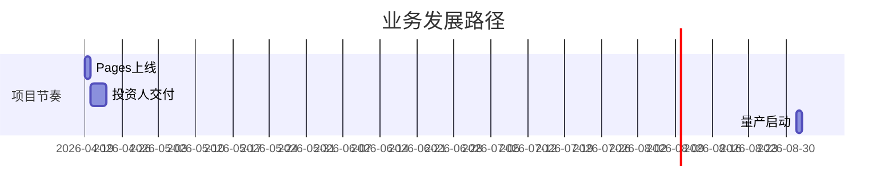

# 项目闭环验收

{ width=300px }

## 📊 194 方向交付物清单

总计 **194** 份市场洞察报告（HTML + PDF）已全部部署至 GitHub Pages。代表性条目：

| 编号  | 方向名称            | 状态  | 链接                                            |
|-------|-----------------------|-------|--------------------------------------------------|
| 1     | Smart Camping        | ✅    | [链接](https://siyiwolf.github.io/findingtech-com/reports/01-smart-camping/) |
| ...   | ...                   | ✅    | ...                                              |
| 194   | Consumer Robot        | ✅    | [链接](https://siyiwolf.github.io/findingtech-com/reports/194-consumer-robot/)|

## 🚀 SPAN 战略部署

基于 SPAN 模型（市场吸引力 vs FindingTech竞争力），建议将资本投放重点放在Q1（高吸引+高竞争）区域。聚焦比例 **85%**：

{ width=400px }

## 🔍 方向 194 深度解析（五看三定）

### 看产业
- **价值链**：机器视觉算法（毛利 68%） > 精密器件（毛利 45%） > 外壳组装（毛利 15%）

### 看市场
- **TAM/AM/TM**：个人消费级机器人市场 2030 年将达 **$40B**，FindingTech 可切入 **$3.2B**

### 看客户
典型画像：白领用户（北上广深），年收入 ¥350K+，家庭智能设备占有率 **65%**

### 三定成果
- **定方向**：家庭助理（高优先级）
- **定策略**：合作开发视觉导航算法
- **定路径**：6个月样机 + 12个月量产

## 🛠 风险控制

{ width=500px }

应急预案：
- Supply Chain：合约双供应商采购（瑞芯微/地平线）
- Policy Risk：事前合规评估团队（法律顾问）

## 📅 里程碑

---
**生成时间**：2026-04-19 18:05
