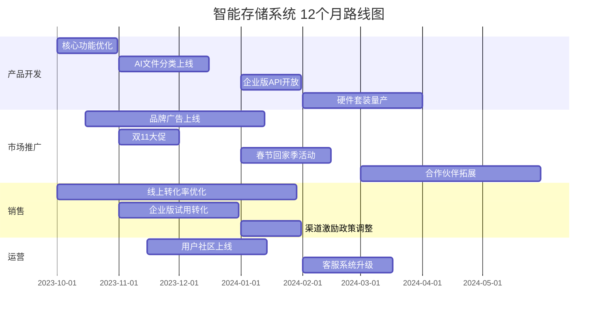

# GTM Strategy: 智能存储系统 (Smart Storage System)

## 1. 概述 (Overview)
**方向**: 智能存储系统（方向19）
**目标**: 构建面向家庭和中小企业的智能存储解决方案，集成数据管理、安全备份、多设备同步和AI增强功能。
**市场定位**: 高性价比、易用性、隐私安全优先，适用于对数据安全和便捷访问有刚需的用户群体。

---

## 2. 产品组合与定价 (Product Portfolio & Pricing)
### 2.1 产品线
| 产品类型               | 功能特性                                                                 | 目标用户               |
|------------------------|--------------------------------------------------------------------------|------------------------|
| **家庭版**             | 1TB/2TB存储，多设备同步，家庭相册管理，文件加密，远程访问              | 家庭用户、学生         |
| **专业版**             | 5TB+/10TB存储，团队协作，版本控制，AI文件分类，自动备份                | 自由职业者、小团队     |
| **企业版**             | 20TB+存储，SAML/OAuth集成，审计日志，数据冗余，API支持                 | 中小企业、初创公司     |
| **硬件套装 (Pro Bundle)** | 高性能NAS设备 + 1年专业版订阅，预装AI加速芯片，一键部署               | 高端家庭、工作室       |

### 2.2 定价策略
- **订阅制**: 按年/月订阅，支持自动续费。
  - 家庭版: ¥59/月 或 ¥599/年
  - 专业版: ¥199/月 或 ¥1999/年
  - 企业版: ¥499/月/用户 或 ¥4999/年/用户 (5用户起)
- **硬件套装**: 一次性付费 + 订阅续费。
  - Pro Bundle: ¥8999 (含1年专业版订阅)
- **免费版**: 50GB存储，基础同步功能，用于获客。
- **折扣**: 年付9折，合作伙伴渠道8折，教育/非营利组织5折。

### 2.3 定价依据
- 同类产品（如坚果云、百度网盘企业版、Synology NAS）的价格分析。
- 用户调研：家庭用户价格敏感度高，企业用户更关注安全和协作功能。
- 成本结构：云存储成本逐年下降，硬件套装利润率高。

---

## 3. 渠道 (Channels)
### 3.1 线上渠道
- **官网**: 直接销售订阅和硬件，提供试用版。
- **电商平台**: 
  - 天猫/京东: 硬件套装主销售渠道，参与618/双11活动。
  - 拼多多: 针对下沉市场，推广家庭版。
- **应用商店**: 
  - iOS/Android: 移动端APP下载，结合免费版获客。
  - Mac/Windows: 桌面端应用，吸引专业用户。
- **合作伙伴**: 
  - 云服务商（如阿里云、腾讯云）: 捆绑销售企业版。
  - 软件开发者: 提供API接入，嵌入到第三方应用（如笔记软件、设计工具）。

### 3.2 线下渠道
- **零售店**: 科技连锁店（如苹果授权店、小米之家）展示硬件套装。
- **企业培训**: 与培训机构合作，推广企业版（如Adobe认证培训中心）。
- **行业展会**: 参加智能家居、云计算展会，现场演示产品。

### 3.3 渠道激励
- **合作伙伴**: 提供30%佣金（订阅首年），技术支持和培训。
- **电商平台**: 季度返利，联合营销活动。
- **线下渠道**: 提供展示设备，培训销售人员。

---

## 4. 营销计划 (Marketing Plan)
### 4.1 品牌定位
- **口号**: 「智能存储，安全无忧」
- **核心卖点**: 
  - 隐私安全: 本地加密 + 零知识架构，数据只有用户自己能解密。
  - AI增强: 自动分类、智能搜索、重复文件识别。
  - 多设备协同: 手机、电脑、NAS之间无缝同步。

### 4.2 推广活动
| 活动名称               | 时间节点       | 渠道               | 预算     | 预期效果               |
|------------------------|----------------|--------------------|----------|------------------------|
| **春节回家季**         | 春节前1个月    | 社交媒体、电商     | ¥50万    | 家庭版新增用户10万     |
| **618大促**            | 6月            | 天猫/京东/官网     | ¥200万   | 销售额突破¥500万       |
| **开学季**             | 8-9月          | 校园合作、微信     | ¥30万    | 学生用户增长5万        |
| **双11硬件节**         | 11月           | 电商、线下零售     | ¥300万   | 硬件套装销售1万台      |
| **企业免费试用**       | 全年           | 官网、BD合作       | ¥100万   | 企业版转化率20%        |

### 4.3 传播策略
- **内容营销**: 
  - 博客/知乎: 撰写《如何选择家庭存储方案》、《企业数据备份指南》。
  - 视频: B站/抖音发布安装教程、使用场景演示。
- **KOL合作**: 
  - 科技类KOL: 体验报告、开箱视频。
  - 家居博主: 智能家庭存储方案推荐。
- **SEO**: 优化关键词「私有云存储」、「NAS替代方案」、「安全备份」。
- **Referral Program**: 老用户邀请新用户，双方各获1个月免费订阅。

### 4.4 公关活动
- **媒体合作**: 与36氪、雷锋网合作，发布产品深度评测。
- **案例研究**: 展示典型客户（如设计师工作室、律师事务所）的使用故事。
- **社区运营**: 微信群/QQ群提供技术支持，用户反馈收集。

---

## 5. 销售流程 (Sales Process)
### 5.1 线上销售流程
1. **获客**: 
   - 免费版试用 → 体验后推送订阅升级优惠。
   - SEO/SEM引流 → 官网着陆页展示核心卖点。
2. **转化**: 
   - 限时折扣、团购优惠。
   - 企业版提供14天免费试用。
3. **支付**: 
   - 支持微信/支付宝/信用卡/企业转账。
4. **激活**: 
   - 邮件/SMS激活，提供新手指南。
5. **留存**: 
   - 定期邮件推送使用技巧。
   - 会员积分制度，兑换增值服务。

### 5.2 线下销售流程
1. **体验**: 零售店展示硬件套装，现场演示。
2. **咨询**: 销售人员提供方案对比（云存储 vs NAS vs 竞品）。
3. **成交**: 提供上门安装服务（增值服务）。
4. **跟进**: 专属客服联系，解决使用问题。

### 5.3 企业销售流程
1. **需求挖掘**: BD团队主动接触潜在客户（如使用竞品的企业）。
2. **方案定制**: 根据企业规模提供定制存储方案。
3. **演示/试用**: 提供企业版试用账号，远程演示。
4. **合同签订**: 线上/线下签订合同，支持分期付款。
5. **部署培训**: 提供API对接、员工培训服务。

---

## 6. 竞争应对 (Competitive Response)
### 6.1 竞争格局
| 竞品               | 优势                          | 劣势                          | 应对策略                     |
|--------------------|-------------------------------|-------------------------------|-------------------------------|
| **坚果云**         | 国内市场认知度高，价格亲民    | 功能单一，安全性饱受质疑      | 强调零知识加密，AI增强功能    |
| **百度网盘企业版** | 品牌背书，集成百度生态        | 价格高，隐私担忧              | 提供更透明的定价和数据保护    |
| **Synology NAS**   | 功能强大，生态丰富            | 操作复杂，价格高              | 简化部署流程，提供硬件套装    |
| **Google Drive**   | 无缝集成Google生态            | 国内访问不稳定，价格高        | 本地化服务，更快的访问速度    |
| **阿里云盘**       | 流量大，背靠阿里云             | 隐私政策模糊，企业功能弱      | 强调完全的数据所有权          |

### 6.2 差异化策略
- **技术层面**: 
  - 零知识加密: 数据在用户设备加密后上传，服务器无法解密。
  - AI增强: 自动分类、智能搜索（如「找出2023年所有PPT文件」）。
  - 多设备协同: 手机、电脑、NAS之间秒级同步。
- **市场层面**: 
  - 聚焦家庭和中小企业，避开巨头的红海竞争。
  - 提供硬件+软件一体化解决方案。

### 6.3 危机应对
- **安全事件**: 
  - 第一时间公开透明，提供解决方案。
  - 邀请第三方安全机构审计。
- **竞品降价**: 
  - 强调产品优势，避免价格战。
  - 推出限时折扣或增值服务。

---

## 7. 12个月路线图 (12-Month Roadmap)

### 7.1 分阶段目标
| 阶段   | 时间范围       | 目标                                                                 |
|--------|----------------|----------------------------------------------------------------------|
| 启动期 | 2023-10 ~ 12   | 核心功能优化，品牌广告上线，双11大促，家庭版用户破10万。            |
| 成长期 | 2024-01 ~ 03   | AI功能上线，企业版试用转化，硬件套装量产，春节回家季活动。          |
| 爆发期 | 2024-04 ~ 06   | 渠道拓展，用户社区活跃，618大促，企业版收入突破¥1000万/月。         |
| 稳定期 | 2024-07 ~ 09   | 运营优化，客服升级，持续获客，实现盈亏平衡。                        |

### 7.2 关键里程碑
- **2023-10**: 核心功能优化完成，品牌广告上线。
- **2023-11**: 双11大促，销售额突破¥300万。
- **2024-01**: AI文件分类功能上线，春节活动启动。
- **2024-02**: 硬件套装量产，首批1000台上市。
- **2024-04**: 企业版收入突破¥500万/月。
- **2024-06**: 618大促，销售额突破¥800万。
- **2024-09**: 实现盈亏平衡。

---

## 8. 风险与应对 (Risks & Mitigation)
| 风险                 | 可能影响               | 应对措施                                   |
|----------------------|------------------------|--------------------------------------------|
| 安全漏洞             | 用户数据泄露，品牌信任下降 | 定期安全审计，漏洞奖励计划，透明公告机制   |
| 市场竞争加剧         | 市场份额下降           | 差异化竞争，聚焦细分市场                   |
| 技术架构扩展性问题   | 用户增长带来性能瓶颈   | 提前规划弹性架构，云原生技术选型           |
| 渠道合作失败         | 销售目标无法达成       | 多元化渠道，建立直销团队                   |
| 用户增长缓慢         | 营收不及预期           | 加大营销投入，优化转化漏斗                 |

---

## 9. 团队与资源 (Team & Resources)
### 9.1 核心团队
- **产品**: 1 PM + 2 开发（负责存储引擎、AI功能）
- **市场**: 1 市场总监 + 2 运营（内容、社群、活动）
- **销售**: 1 销售总监 + 3 BD（线上、线下、企业）
- **客服**: 1 客服主管 + 2 全职客服 + 兼职远程
- **技术支持**: 2 工程师（部署、API支持）

### 9.2 预算分配
| 项目                 | 预算（¥）      |
|----------------------|----------------|
| 产品开发             | 200万          |
| 市场推广             | 300万          |
| 销售激励             | 150万          |
| 运营                 | 80万           |
| 硬件成本             | 200万          |
| 云存储成本           | 100万          |
| **总计**             | **1030万**     |

### 9.3 外部资源
- **合作伙伴**: 云服务商（阿里云、腾讯云）、硬件供应商。
- **第三方服务**: 支付接口（微信支付、支付宝）、客服系统（Udesk）。
- **咨询顾问**: 安全审计（慢雾科技）、市场调研（尼尔森）。

---

## 10. 衡量指标 (Success Metrics)
### 10.1 北极星指标
- **MAU (月活跃用户)**: 目标100万（2024-12）。
- **付费转化率**: 免费→付费 15%（家庭版），企业试用→付费 30%。
- **客单价**: 家庭版 ¥89/月，企业版 ¥499/月/用户。
- **NPS (净推荐值)**: ≥ 50。

### 10.2 过程指标
| 指标                 | 目标（2024-12） |
|----------------------|----------------|
| 注册用户             | 300万          |
| 免费版存储使用量     | 5PB            |
| 付费版存储使用量     | 2PB            |
| 硬件套装销量         | 2万台          |
| 企业版客户数         | 500家          |
| 客服满意度           | ≥ 90%          |

---

## 11. 附录 (Appendix)
### 11.1 名词解释
- **零知识加密**: 数据在客户端加密后上传，服务器无法解密，仅用户持有密钥。
- **AI文件分类**: 基于文件内容和元数据，自动标记文件类型、时间、关键词。
- **多设备同步**: 支持手机、电脑、NAS之间实时同步，变更秒级生效。

### 11.2 参考资料
- 坚果云2023年财报
- Synology NAS用户调研报告
- 中国云存储市场规模（IDC 2023）