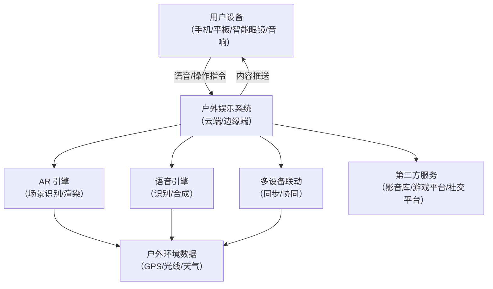

# PRD-17：户外娱乐系统

## 1. 产品概述
### 1.1 背景
户外娱乐系统旨在将智能家居的娱乐功能延伸到户外场景，通过增强现实（AR）、语音交互和多设备联动，为用户提供沉浸式的户外娱乐体验。该系统适用于家庭庭院、露营、公园等开放空间，满足用户在户外环境下的影音、游戏、社交和互动需求。

### 1.2 目标
- 打造无缝衔接的户外娱乐体验，摆脱室内空间限制。
- 通过 AR 技术增强户外场景的互动性和趣味性。
- 支持多设备协同（如手机、平板、智能眼镜、音响），实现跨设备联动。
- 提供低延迟、高稳定性的户外网络解决方案，确保流畅体验。

### 1.3 核心价值
- **沉浸感**：通过 AR 将虚拟内容与真实户外环境融合，创造身临其境的娱乐体验。
- **社交性**：支持多人互动模式，适合家庭聚会、朋友聚会等场景。
- **便捷性**：语音控制和智能推荐功能，降低操作门槛。
- **安全性**：设备和内容适配户外环境，防水防尘，适应不同天气条件。

---

## 2. 用户故事与用例
### 2.1 用户故事
#### 故事1：庭院影院
**角色**：家庭用户（户主、孩子、老人）
**场景**：周末晚上，庭院架起投影仪，家人聚在一起观看电影。
**需求**：
- 通过语音命令调节投影仪亮度、音响音量，播放电影。
- AR 提示座位区域的安全范围，避免碰撞。
- 智能眼镜支持字幕显示和实时翻译（如需）。
- 支持手机遥控和多人评论互动。

#### 故事2：户外游戏派对
**角色**：年轻用户（朋友聚会）
**场景**：露营时，朋友们使用智能设备进行 AR 游戏对战。
**需求**：
- AR 游戏将真实场景（如树木、河流）作为游戏元素，增强互动性。
- 语音指令控制游戏进程（如「开始游戏」「暂停」）。
- 多设备同步，确保所有玩家同步体验。
- 支持局域网模式，无需依赖公网。

#### 故事3：公园音乐会
**角色**：音乐爱好者（个人或乐队）
**场景**：公园举办小型音乐会，观众通过智能设备参与互动。
**需求**：
- AR 提供舞台特效（如烟花、虚拟乐器演奏动画）。
- 支持观众通过手机投票选择歌曲，实时生成歌单。
- 户外音响系统自动适配环境音量，确保清晰播放。

### 2.2 用例
| 用例编号 | 用例名称               | 描述                                                                 | 参与者               |
|----------|------------------------|----------------------------------------------------------------------|----------------------|
| UC-1     | 语音控制娱乐设备       | 用户通过语音命令控制投影仪、音响、灯光等设备。                      | 家庭用户、年轻用户   |
| UC-2     | AR 场景互动            | AR 将虚拟元素叠加到真实环境中，用户可与之互动（如游戏道具、虚拟宠物）。 | 年轻用户、儿童       |
| UC-3     | 多人游戏联机           | 支持局域网或公网多人游戏，同步游戏进程和数据。                      | 年轻用户、朋友群体   |
| UC-4     | 智能推荐内容           | 根据场景（如露营、聚会）和用户偏好推荐影音内容。                    | 所有用户             |
| UC-5     | 户外环境适配           | 设备自动适配户外光线、噪音、天气等环境因素。                        | 所有用户             |

---

## 3. 功能规格
### 3.1 AR 互动功能
| 功能模块          | 描述                                                                 | 技术要求                                                                 |
|-------------------|----------------------------------------------------------------------|--------------------------------------------------------------------------|
| AR 场景识别       | 识别户外环境（如草地、树木、建筑物）并叠加虚拟内容。                | 计算机视觉（OpenCV）、SLAM（同时定位与地图构建）、环境光线适配。        |
| AR 游戏           | 支持 AR 游戏，如寻宝、对战、模拟运动等。                            | Unity/ARKit/ARCore、物理引擎、多人同步协议。                            |
| AR 社交互动       | 支持虚拟角色、表情包、动作同步等社交功能。                          | 实时渲染、动作捕捉、WebRTC。                                            |
| 虚拟导航          | AR 箭头或路径指引用户在户外移动（如公园导览）。                    | GPS/北斗定位、路径规划算法。                                            |

### 3.2 语音交互功能
| 功能模块          | 描述                                                                 | 技术要求                                                                 |
|-------------------|----------------------------------------------------------------------|--------------------------------------------------------------------------|
| 语音识别          | 识别用户语音命令（如「播放音乐」「调高音量」）。                    | 语音识别引擎（如科大讯飞、百度语音）、降噪算法。                        |
| 语音合成          | 将文本转换为自然语音播报（如游戏提示、天气预报）。                  | TTS（文本转语音）引擎、声音风格定制。                                  |
| 多轮对话          | 支持上下文理解的多轮对话（如「今天有什么好看的电影？」→「推荐XXX」）。 | 对话管理系统、自然语言处理（NLP）。                                    |
| 语音适配户外      | 在嘈杂环境下保持高识别率。                                          | 环境噪音抑制、麦克风阵列优化。                                          |

### 3.3 互动娱乐功能
| 功能模块          | 描述                                                                 | 技术要求                                                                 |
|-------------------|----------------------------------------------------------------------|--------------------------------------------------------------------------|
| 多设备联动        | 手机、平板、智能眼镜、音响等设备同步控制。                          | 蓝牙/Wi-Fi Direct、设备发现协议、数据同步。                            |
| 影音播放          | 支持高清视频、环绕声播放，适配户外环境。                            | 视频编解码（H.265）、音频处理（杜比音效）、投影仪适配。                |
| 社交分享          | 支持实时分享照片、视频、游戏记录到社交平台。                        | API 集成（微信、QQ、抖音等）、内容审核。                              |
| 智能推荐          | 根据场景、天气、时间推荐娱乐内容。                                  | 推荐算法、用户画像分析、场景识别。                                      |

---

## 4. 技术架构
### 4.1 系统架构图

### 4.2 核心组件
| 组件          | 技术选型                          | 职责                                                                 |
|---------------|-----------------------------------|----------------------------------------------------------------------|
| AR 引擎       | ARKit（iOS）、ARCore（Android）   | 场景识别、虚拟内容渲染、SLAM 定位。                                  |
| 语音引擎      | 科大讯飞/百度语音                  | 语音识别、合成、对话管理。                                            |
| 多设备联动    | Wi-Fi Direct/蓝牙                 | 设备发现、数据同步、协同控制。                                        |
| 内容管理      | 云端服务器/边缘计算                | 影音库、游戏库、用户数据存储。                                        |
| 网络传输      | WebRTC/QUIC                       | 低延迟数据传输、多人同步。                                            |
| 环境适配      | 传感器融合（GPS/光线/气压）        | 户外环境数据采集与适配。                                              |

### 4.3 数据流
1. **输入**：用户通过设备发出语音或操作指令（如「开始 AR 游戏」）。
2. **处理**：
   - 语音引擎识别指令并转换为系统操作。
   - AR 引擎识别户外场景并渲染虚拟内容。
   - 多设备联动模块同步数据到所有参与设备。
3. **输出**：虚拟内容显示在设备上，音频通过户外音响播放。

---

## 5. MVP 范围
### 5.1 MVP 功能列表
| 功能模块          | MVP 要求                                                                 | 备注                                                                 |
|-------------------|--------------------------------------------------------------------------|----------------------------------------------------------------------|
| AR 场景识别       | 支持基本户外场景识别（如草地、树木），叠加简单虚拟物体（如球、动物）。 | 使用 ARKit/ARCore，限制复杂场景。                                    |
| 语音控制          | 支持核心语音命令（如「播放」「暂停」「调节音量」）。                    | 集成科大讯飞/百度语音，优化户外降噪。                                |
| 影音播放          | 支持投影仪+音响联动，播放本地/在线视频。                                | 适配常见视频格式（MP4、MKV），限制 4K 播放。                          |
| 多人游戏          | 支持局域网内 2-4 人 AR 游戏（如寻宝、球类游戏）。                      | 使用 Unity 开发，简化游戏复杂度。                                    |
| 设备联动          | 手机和平板同步控制影音播放，音响同步音频输出。                          | 使用 Wi-Fi Direct，限制设备数量（≤4 台）。                            |

### 5.2 排除项
- 公网多人游戏（保留局域网模式）。
- 高级 AR 特效（如虚拟角色动画、复杂物理模拟）。
- 社交分享功能（保留本地分享至微信/QQ）。
- 复杂环境适配（如雨天/强光场景）。

### 5.3 技术验证
- **AR 识别准确率**：≥90% 在常见户外环境（如公园、庭院）。
- **语音识别准确率**：≥95% 在户外噪音环境（≤60dB）。
- **设备联动延迟**：≤100ms 同步延迟。
- **影音播放流畅度**：1080p 视频无卡顿（≥24fps）。

---

## 6. 风险与依赖
### 6.1 风险
| 风险              | 影响                               | 缓解措施                                                                 |
|-------------------|------------------------------------|--------------------------------------------------------------------------|
| 户外环境复杂      | AR 识别率下降、语音识别干扰。      | 优化算法，增加环境数据采集模块。                                        |
| 多设备同步延迟    | 游戏/影音体验不流畅。              | 采用 WebRTC/QUIC 协议，优化传输算法。                                  |
| 内容版权限制      | 影音/游戏内容无法商用。            | 合作第三方平台（如腾讯视频、网易云音乐），获取授权。                    |
| 设备兼容性        | 不同品牌设备联动困难。              | 制定设备兼容标准，提供适配指南。                                        |

### 6.2 依赖
| 依赖              | 用途                               | 替代方案                                                                 |
|-------------------|------------------------------------|--------------------------------------------------------------------------|
| ARKit/ARCore      | AR 场景识别与渲染。                | 使用 OpenCV + SLAM 自研方案（成本较高）。                              |
| 第三方语音引擎    | 语音识别与合成。                    | 使用开源引擎（如 Kaldi），但准确率可能降低。                            |
| 第三方内容平台    | 影音/游戏内容来源。                | 自建内容平台（需大量资源）。                                            |

---

## 7. 发布计划
| 阶段          | 时间      | 内容                                                                 |
|---------------|-----------|----------------------------------------------------------------------|
| Alpha         | Week 4    | 内部测试 MVP 功能，验证核心体验。                                    |
| Beta          | Week 6    | 小范围公测，收集用户反馈，优化性能。                                |
| Release       | Week 8    | 正式发布，支持主流设备（iOS/Android），开放下载。                  |