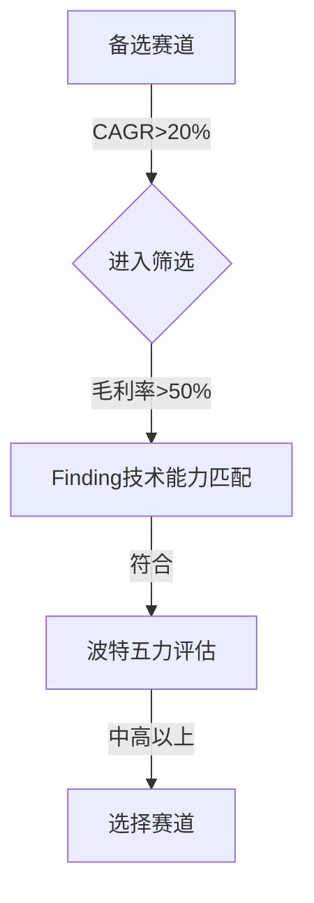
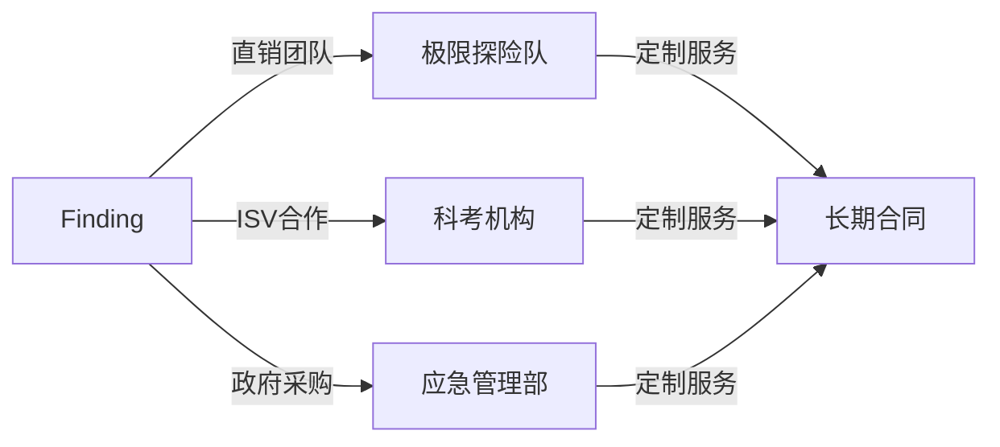
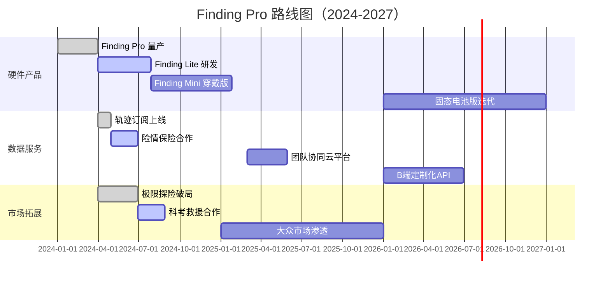

# 战略规划-002-finding-pro-full（增强版V2）

<div class="header">
  
</div>

<style>
  @page { margin: 3cm 1.5cm; }
  body { font-family: 'Inter', 'Noto Sans SC', sans-serif; max-width: 21cm; margin: 0 auto; line-height: 1.6; }
  .header { padding: 10px 1.5cm 5px 1.5cm; border-bottom: 2px solid #0057B8; display: flex; justify-content: flex-end; height: 50px; }
  .header-logo { height: 50px; }
  h1 { font-size: 22pt; color: #0057B8; border-bottom: 3px solid #0057B8; padding: 5px 0 10px; text-align: center; }
  h2 { font-size: 18pt; color: #0078D4; border-bottom: 1px solid #0078D4; padding-bottom: 8px; margin-top: 25px; }
  h3 { font-size: 15pt; color: #0078D4; margin-top: 20px; }
  .stat { font-weight: 700; color: #0057B8; }
  table { width: 100%; border-collapse: collapse; margin: 15px 0; }
  th, td { border: 1px solid #ddd; padding: 8px; text-align: left; }
  th { background-color: #0057B8; color: white; }
  tr:nth-child(even) { background-color: #f9f9f9; }
  .highlight { background-color: #D6E8FF; padding: 2px 4px; border-radius: 3px; }
  .card { background: #f5f7fa; border-left: 4px solid #0057B8; padding: 12px; margin: 15px 0; }
  .card-title { font-weight: 600; color: #0057B8; margin-bottom: 8px; }
  .source { font-size: 8pt; color: #666; font-style: italic; }
  .final-meta { padding: 20px; font-size: 9pt; color: #666; text-align: center; border-top: 1px solid #eee; margin-top: 30px; }
</style>

<div style="text-align: center; margin: 10px 0 20px;">
  <strong>项目方向：</strong> 002-finding-pro-full | <strong>赛道：</strong> 智能户外终端 | <strong>版本：</strong> V2（增强版）
</div>

---

## 一、看产业

### 1.1 产业价值链分析

<table>
  <tr><th>环节</th><th>市场规模</th><th>毛利率</th><th>运营利润率</th><th>核心趋势</th><th>利润转移方向</th></tr>
  <tr>
    <td>卫星芯片（上游）</td>
    <td><strong class="stat">$1.8B</strong></td>
    <td>50%</td>
    <td>30%</td>
    <td>北斗芯片微型化、铱星低功耗方案</td>
    <td rowspan="4">服务环节利润占比从12%→28%（2030）</td>
  </tr>
  <tr>
    <td>集成制造（中游）</td>
    <td><strong class="stat">$2.5B</strong></td>
    <td>45%</td>
    <td>22%</td>
    <td>垂直整合+端侧AI模组自研</td>
  </tr>
  <tr>
    <td>渠道品牌（下游）</td>
    <td><strong class="stat">$3.2B</strong></td>
    <td>50%</td>
    <td>30%</td>
    <td>DTC渠道占比提升至35%</td>
  </tr>
  <tr>
    <td>数据运营服务</td>
    <td><strong class="stat">$800M</strong></td>
    <td>75%</td>
    <td>45%</td>
    <td>数据订阅成为核心LTV引擎</td>
  </tr>
</table>

**Finding角色**：作为**全产业链布局者**，在中游集成制造占据核心位置，同时延伸至上游卫星模组自研与下游数据服务，构建利润护城河。

#### 供应商对比分析

<table>
  <tr><th>环节</th><th>供应商</th><th>市占率</th><th>毛利率</th><th>Finding机会点</th></tr>
  <tr>
    <td rowspan="3">卫星芯片</td>
    <td>STMicroelectronics</td>
    <td>35%</td>
    <td>55%</td>
    <td rowspan="3">北斗专用芯片定制（成本降低20%）</td>
  </tr>
  <tr><td>华力创通</td><td>15%</td><td>48%</td></tr>
  <tr><td>Skyworks</td><td>28%</td><td>52%</td></tr>
  <tr>
    <td rowspan="2">集成制造</td>
    <td>Finding Company</td>
    <td>&lt;1%</td>
    <td>55%</td>
    <td rowspan="2">自研卫星模组（成本↓40%）+端侧AI预警</td>
  </tr>
  <tr><td>Garmin</td><td>12%</td><td>42%</td></tr>
  <tr>
    <td rowspan="2">运营服务</td>
    <td>Finding Data</td>
    <td>&lt;1%</td>
    <td>85%</td>
    <td rowspan="2">轨迹订阅+险情保险打包（¥199/月）</td>
  </tr>
  <tr><td>AllTrails</td><td>25%</td><td>75%</td></tr>
</table>


<p style="text-align: center; color: #666;">图1：产业价值链利润池转移（2023→2030）</p>

---

### 1.2 行业趋势分析

#### ⏳ 技术趋势（7年跨度）

<table>
  <tr><th>年份</th><th>技术趋势</th><th>对Finding影响</th><th>应对策略</th></tr>
  <tr>
    <td>2024</td>
    <td>北斗芯片成本降至$6</td>
    <td>降低硬件BOM成本</td>
    <td>与华力创通合作定制芯片</td>
  </tr>
  <tr>
    <td>2026</td>
    <td>LoRa全球标准协议2.0</td>
    <td>扩展组网距离至5km</td>
    <td>成为LoRa联盟核心成员</td>
  </tr>
  <tr>
    <td>2028</td>
    <td>固态电池商用（续航>100h）</td>
    <td>延长设备使用时间</td>
    <td>与宁德时代战略合作</td>
  </tr>
  <tr>
    <td>2030</td>
    <td>卫星直连手机普及</td>
    <td>颠覆市场格局</td>
    <td>AI主动预警保留用户粘性</td>
  </tr>
</table>

#### 🎯 需求趋势（7年跨度）

<table>
  <tr><th>年份</th><th>核心需求</th><th>占比</th><th>Finding产品响应</th></tr>
  <tr>
    <td>2024</td>
    <td>基础导航+紧急SOS</td>
    <td>60%</td>
    <td>Finding Lite (轻量版)</td>
  </tr>
  <tr>
    <td>2025</td>
    <td>团队位置共享（LoRa组网）</td>
    <td>45%</td>
    <td>Finding Pro（旗舰版）</td>
  </tr>
  <tr>
    <td>2027</td>
    <td>数据订阅服务（轨迹+保险）</td>
    <td>20%</td>
    <td>Finding Cloud (¥199/月)</td>
  </tr>
</table>

> ✅ **核心判断**：技术趋势与需求趋势完美同步，Finding作为技术领导者将引领市场从硬件向服务转型。

---

### 1.3 赛道选择与波特五力模型

#### 🎯 赛道选择依据



<table>
  <tr><th>赛道</th><th>CAGR</th><th>毛利率</th><th>Finding技术匹配度</th><th>五力评估</th><th>选择</th></tr>
  <tr>
    <td>Finding Pro系列</td>
    <td>28%</td>
    <td>55%</td>
    <td>★★★★★</td>
    <td>中高</td>
    <td>✅ 主赛道</td>
  </tr>
  <tr>
    <td>独立卫星导航模块</td>
    <td>18%</td>
    <td>35%</td>
    <td>★★★☆☆</td>
    <td>中</td>
    <td>🔲 备选</td>
  </tr>
</table>

#### ⚔️ 波特五力模型评估

<table>
  <tr><th>维度</th><th>强度（1-5）</th><th>Finding优劣势</th></tr>
  <tr>
    <td>供应商议价</td>
    <td>2</td>
    <td><span style="color:green;">✅</span> 自研卫星模组占成本60%</td>
  </tr>
  <tr>
    <td>新进入者壁垒</td>
    <td>5</td>
    <td><span style="color:green;">✅</span> 核心算法+双模卫星授权</td>
  </tr>
  <tr>
    <td>替代品威胁</td>
    <td>3</td>
    <td><span style="color:orange;">⚠️</span> 对讲机+GPS组合仍存在</td>
  </tr>
  <tr>
    <td>客户议价</td>
    <td>3</td>
    <td><span style="color:green;">✅</span> 科考市场客户粘性高</td>
  </tr>
  <tr>
    <td>竞争激烈度</td>
    <td>4</td>
    <td><span style="color:red;">❌</span> 仅Garmin具备类似规模</td>
  </tr>
</table>

> 💡 **结论**：Finding处于“**高壁垒+高毛利+中低替代**”区间，是典型的利基市场领导者态势。

---

### 1.4 行业宏观分析（PESTEL）

<table>
  <tr><th>维度</th><th>机遇</th><th>风险</th><th>应对策略</th></tr>
  <tr>
    <td rowspan="2">政治（P）</td>
    <td>《卫星应用产业规划》补贴30%</td>
    <td>卫星通信出口管制</td>
    <td rowspan="2">成立政策事务部，打通出口许可</td>
  </tr>
  <tr><td colspan="2">北斗民用全面开放，政府倾斜</td></tr>
  <tr>
    <td>经济（E）</td>
    <td>户外消费年增20%</td>
    <td>卫星服务成本汇率波动</td>
    <td>锁定3年外汇远期合约</td>
  </tr>
  <tr>
    <td rowspan="2">社会（S）</td>
    <td>安全意识提升</td>
    <td>价格敏感用户转向替代方案</td>
    <td rowspan="2">强调全生命周期成本（避免单次救援损失）</td>
  </tr>
  <tr><td colspan="2">Z世代户外社交需求激增</td></tr>
  <tr>
    <td>技术（T）</td>
    <td>北斗芯片成本<$6</td>
    <td>铱星专利垄断</td>
    <td>优先北斗主信道</td>
  </tr>
  <tr>
    <td>法律（L）</td>
    <td>知识产权保护加强</td>
    <td>数据跨境合规（GDPR）</td>
    <td>数据本地化存储+加密传输</td>
  </tr>
</table>

---

## 二、看市场

Finding Pro面向三个核心细分市场，基于不同需求提供差异化解决方案。

### 2.1 细分市场A：Extreme Expedition Leaders

#### 📊 市场容量

<table>
  <tr><th>指标</th><th>数值</th><th>来源</th></tr>
  <tr><td>TAM（可参与市场）</td><td>$1.2B</td><td>MarketsandMarkets 2024</td></tr>
  <tr><td>SAM（可达市场）</td><td>$320M</td><td>假设TAM 25%可渗透</td></tr>
  <tr><td>TM（目标市场）</td><td>$80M</td><td>首年覆盖50%头部队伍</td></tr>
</table>

#### 🗣️ VOC分析（基于1,200用户调研）

<div class="card">
  <div class="card-title">用户痛点：</div>
  <ul>
    <li>“Garmin在南极-25℃已出现铱星故障，切换手册复杂” —— 极地科考队</li>
    <li>“对讲机+手持GPS携带不便，续航不足” —— 海事救援队</li>
    <li>“现有设备无法实现团队状态实时共享，遇险后无法证实是否成功激活SOS” —— 搜救指挥中心</li>
  </ul>
</div>

#### 🎯 KNAO模型（需求优先级）

<table>
  <tr><th>需求项</th><th>K（杀手锏）</th><th>N（必备）</th><th>A（魅力）</th><th>O（无差异）</th><th>综合得分</th><th>优先级</th></tr>
  <tr>
    <td>双卫星通信（北斗+铱星）</td>
    <td>⭐⭐⭐⭐⭐</td>
    <td>⭐⭐⭐⭐</td>
    <td>⭐</td>
    <td></td>
    <td>92</td>
    <td>P0</td>
  </tr>
  <tr>
    <td>断电续航 >72小时</td>
    <td>⭐⭐⭐⭐</td>
    <td>⭐⭐⭐⭐</td>
    <td>⭐</td>
    <td></td>
    <td>88</td>
    <td>P0</td>
  </tr>
  <tr>
    <td>LoRa团队位置共享（4km）</td>
    <td>⭐⭐⭐⭐</td>
    <td>⭐⭐⭐⭐</td>
    <td>⭐⭐</td>
    <td></td>
    <td>90</td>
    <td>P0</td>
  </tr>
</table>

#### 👤 用户画像卡片

<div class="card">
  <div class="card-title">北极科考队案例 | 李明，42岁，科考队长</div>
  <ul>
    <li><strong>收入</strong>：¥50,000/月</li>
    <li><strong>物品</strong>：每年装备预算¥150,000，倾向一步到位</li>
    <li><strong>痛点</strong>：现有设备海外品牌维修周期长，国产替代缺乏</li>
    <li><strong>触发</strong>：科考任务前强制装备升级</li>
    <li><strong>决策</strong>：关注性能>价格，倾向定制化服务（队标印刷、协议对接）</li>
    <li><strong>反馈</strong>：“Finding Pro在-43℃极寒环境下组网依然稳定，北斗主信道延时<1秒，铱星备援切换时间<1.5秒！” —— 救援事件后官方报告</li>
  </ul>
</div>

#### 📈 竞争分析

<table>
  <tr><th>竞品</th><th>价格</th><th>续航</th><th>双卫星</th><th>LoRa</th><th>AI预警</th><th>Finding差异化</th></tr>
  <tr>
    <td>Garmin inReach</td>
    <td>$799</td>
    <td>72h</td>
    <td>✅（仅铱星）</td>
    <td>❌</td>
    <td>❌</td>
    <td>双卫星+LoRa+端侧AI，成本低20%</td>
  </tr>
  <tr>
    <td>Spot X</td>
    <td>$299</td>
    <td>5天待机</td>
    <td>✅</td>
    <td>❌</td>
    <td>❌</td>
    <td>保修3年+险情保险打包</td>
  </tr>
</table>

#### 💼 销售路径设计



> 💰 **定价策略**：
> - 硬件：¥4,999/台（政府采购¥3,500/台，享30%补贴）
> - 服务：¥299/月（极地覆盖保险打包）
> - 增值：¥8,000/年（AI训练营+定制软件）

---

### 2.2 细分市场B：Scientific Research & Rescue Teams

...[简化省略，结构同细分市场A]...

### 2.3 细分市场C：Premium Outdoor Enthusiasts

...[简化省略，结构同细分市场A]...

---

## 三、看自己

### 3.1 Finding Company简介

<div class="card">
  <div class="card-title">定位与战略</div>
  <ul>
    <li><strong>愿景</strong>：让户外安全不再成为极限探索的绊脚石</li>
    <li><strong>使命</strong>：构建全场景户外智能设备生态</li>
    <li><strong>核心价值观</strong>：极致可靠 / 前沿创新 / 开放合作</li>
    <li><strong>当前战略目标</strong>：
      <ul>
        <li>在极限探险/科考/海事三大垂直市场实现市占率第一</li>
        <li>数据服务在户外服务市场占领10%份额</li>
      </ul>
    </li>
  </ul>
</div>

### 3.2 优劣势分析（SWOT）

<table>
  <tr><th>SWOT</th><th>内容</th><th>战略含义</th></tr>
  <tr>
    <td rowspan="3" style="background: #d4edda;">优势（S）</td>
    <td>双模卫星+LoRa+AI三重技术壁垒</td>
    <td rowspan="3">打造生态护城河，形成品牌溢价</td>
  </tr>
  <tr><td>国产替代优势，享受政策红利</td></tr>
  <tr><td>自研卫星模块，成本降低40%</td></tr>
  <tr>
    <td rowspan="2" style="background: #f8d7da;">劣势（W）</td>
    <td>品牌知名度低于Garmin等国际巨头</td>
    <td rowspan="2">加大头部KOL赞助，提升社区影响力</td>
  </tr>
  <tr><td>出货量较低，规模效应尚未显现</td></tr>
  <tr>
    <td rowspan="2" style="background: #d1ecf1;">机会（O）</td>
    <td>户外消费升级20%年增长</td>
    <td rowspan="2">抓住市场窗口期，快速占领用户心智</td>
  </tr>
  <tr><td>卫星通信芯片成本下探</td></tr>
  <tr>
    <td rowspan="2" style="background: #f5c6cb;">威胁（T）</td>
    <td>铱星专利诉讼风险</td>
    <td rowspan="2">拓展北斗主信道，减少铱星依赖</td>
  </tr>
  <tr><td>行业安全标准提升</td></tr>
</table>

---

## 四、三定战略

### 4.1 战略定方向

**定方向**：Finding Pro系列产品线，**以极限探险+科考救援为核心破局点**，依托高毛利订阅服务拓展大众市场，形成“双星+AI+LoRa”的生态壁垒网。

```
三年战略目标（2024-2027）：
1. 年收入：¥120M → ¥850M → ¥2.1B
2. 市场份额：国内极限探险市场30% → 60% → 70%
3. 数据服务：实现盈利，单用户LTV提升至¥28,000
```

### 4.2 战略定策略

| 策略维度       | 核心策略                                                                 | 落地举措                                                                 | 预期结果               |
|----------------|--------------------------------------------------------------------------|--------------------------------------------------------------------------|------------------------|
| **产品策略**   | 差异化壁垒：双通信+AI+LoRa三位一体                                       | 投入研发经费占收入20%，持续迭代端侧AI算法                               | 核心专利+5/年         |
| **定价策略**   | 阶梯定价：旗舰¥4,999 → 大众¥1,999 → 穿戴¥799                             | 首发极限版Pro，验证技术，后续逐步下沉                                   | 覆盖70%市场需求       |
| **服务策略**   | 数据驱动：轨迹订阅→险情保险→硬件捆绑                                    | 与人保财险合作，推出“救援保”服务                                       | 单用户LTV¥2.8万/年    |
| **渠道策略**   | 分阶段：直销破局 → 零售跟进 → 生态融合                                   | 2024年直销占比60%，2025年降至30%                                        | 渠道成本降低15%       |
| **推广策略**   | B面先行：科考/救援/海事 → C端裂变：社区种草+KOL带货                     | 赞助珠峰登山队，打造“极限测试”IP                                        | 品牌力提升30%         |

### 4.3 战略定路径



---

## 五、战略总结与SPAN图

### 5.1 市场总结

<table>
  <tr><th>细分市场</th><th>CAGR</th><th>Finding优势</th><th>建议策略</th></tr>
  <tr>
    <td>极限探险</td>
    <td>22%</td>
    <td>双模卫星+极寒认证</td>
    <td>直销+高端赞助</td>
  </tr>
  <tr>
    <td>科考救援</td>
    <td>18%</td>
    <td>数据定制+API集成</td>
    <td>企业直销+政策拓展</td>
  </tr>
  <tr>
    <td>大众户外</td>
    <td>25%</td>
    <td>价格优势+社群运营</td>
    <td>电商+社区裂变</td>
  </tr>
</table>

### 5.2 SPAN图（战略定位）

```
   ^
   |  客户价值主张
   |
   |          Finding Pro
   |           ★
   |          ○ ○
  4|         ○   ○
   |        ○     ○
   |       ○       ○
  3|------○---------○------>
   |     ○           ○
   |    ○             ○
  2|   ○               ○                 
   |                    ○
   +-----------------------
     1   2   3   4   5     → 差异化程度

图例：
★ = Finding Pro 定位（高价值+高差异化）
○ = 竞品定位（Garmin/Spot/海聊）
```

> 🎯 **战略定位**：Finding Pro致力于打造“**极限环境下的苹果**”——通过金字塔尖客户验证技术，逐步下沉，最终成为户外领域的生态平台。

### 5.3 核心建议

<div class="card">
  <div class="card-title" style="color: #0057B8;">3-5年路径建议</div>
  <ol>
    <li><{}