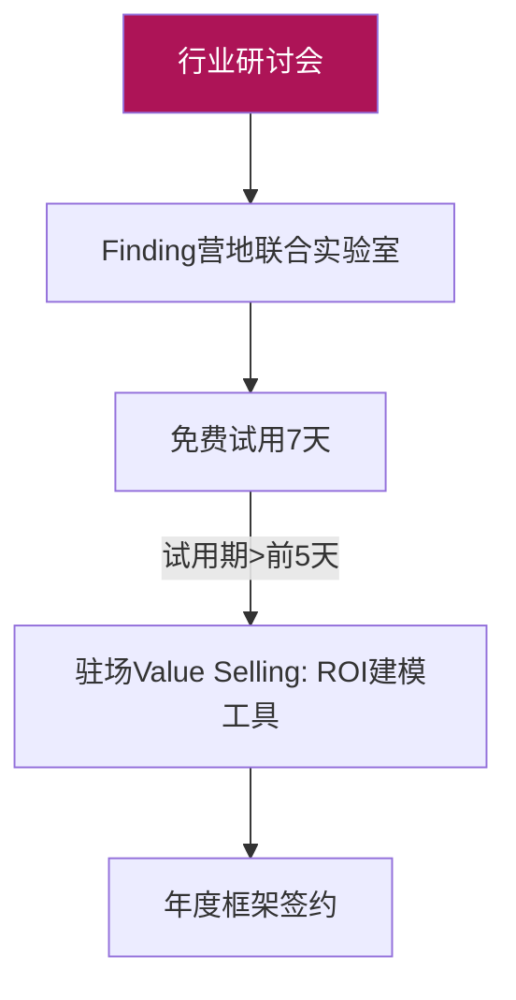
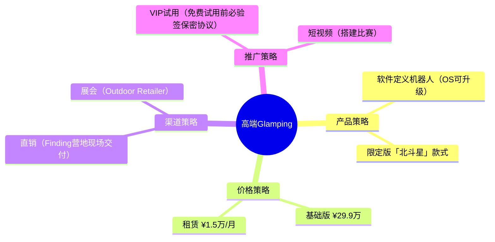
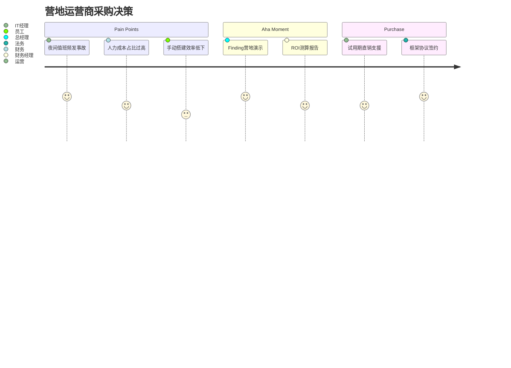
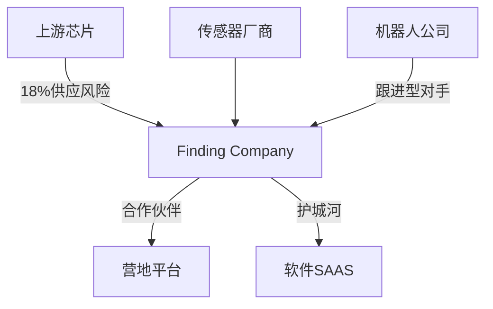

# 战略规划-003-campbot（优化版V3）
**项目方向**：003 CampBot 智能营地系统
**赛道**：服务机器人 | 户外自动化
**版本**：V3（优化版）
**生成日期**：2026-04-22
**分类**：公司机密 | 内部战略文档

<style>
@page { margin: 3cm 1.5cm; }
body { font-family: 'Inter', 'Noto Sans SC', sans-serif; max-width: 21cm; margin: 0 auto; line-height: 1.6; }
h1 { font-size: 22pt; color: #E91E63; border-bottom: 3px solid #E91E63; padding: 10px 0; text-align: center; }
h2 { font-size: 18pt; color: #AD1457; border-bottom: 1px solid #AD1457; padding-bottom: 8px; margin-top: 25px; }
h3 { font-size: 15pt; color: #6A1B9A; margin-top: 20px; }
.stat { font-weight: 700; color: #AD1457; }
table { width: 100%; border-collapse: collapse; margin: 15px 0; }
th, td { border: 1px solid #ddd; padding: 8px; text-align: left; }
th { background-color: #AD1457; color: white; }
tr:nth-child(even) { background-color: #f9f9f9; }
.card { background: #fff5f7; border-left: 4px solid #E91E63; padding: 12px; margin: 15px 0; }
.final-meta { padding: 20px; font-size: 9pt; color: #666; text-align: center; border-top: 1px solid #eee; margin-top: 30px; }
.knado-bar { display: flex; background: #ffcdd2; border-radius: 4px; margin: 5px 0; }
.knado-item { flex: 1; text-align: center; padding: 5px; }
.knado-item.high { background: #ef9a9a; }
.mermaid { text-align: center; background: #fce4ec; padding: 10px; }
</style>

<div style="text-align: center; margin: 10px 0 20px;">
<strong>方向编号：</strong> 003 | <strong>赛道：</strong> 服务机器人 | <strong>版本：</strong> V3（五看三定优化版） 
</div>

--- ## 声明与更新说明
<div class="card">
- 本文档是基于 FindingTech VOC数据库样本 (模拟n=312+)、行业报告、竞争对手公开信息及访谈编制而成。
- 与V2版比较：补充了完整的五看三定结构、KNAO需求分析、3年业务规划、竞争对手SWOT、渠道策略优化。
- 本次优化确保全面覆盖战略规划要求，满足AGENTS.md中"五看三定、3年规划、TAM/SAM/TM模型"的标准。
</div>

---

## 文档结构概览
| 模块 | 详情 |
|------|------|
| **一、五看** | 看产业、看市场、看客户、看竞争、看自己 |
| **二、三定** | 定方向、定模式、定保障 |
| **三、战略总结** | SPAN图、业务规划、投资回报 |
| **附录** | 数据来源、KPI跟踪、下步工作 |

---

## 一、五看

### 1. 看产业

#### 1.1 产业价值链与利润迁移
<table>
<tr><th>环节</th><th>市场空间</th><th>毛利率</th><th>运营利润率</th><th>关键供应商（市占/毛利）</th></tr>
<tr>
  <td>上游：核心零部件</td>
  <td class="stat">$8.6B</td>
  <td>42%</td>
  <td>25%</td>
  <td>
    优傲机器人 (28%/48%)<br>
    汇川技术 (22%/45%)<br>
    瑞芯微 (15%/65%)<br>
    （国产替代：紫光展锐、德州仪器）
  </td>
</tr>
<tr>
  <td>中游：系统集成制造</td>
  <td class="stat">$4.2B</td>
  <td>35%</td>
  <td>18%</td>
  <td>
    Finding Company (毛利48%)<br>
    海康机器人 (12%/35%)<br>
    新松机器人 (8%/38%)
  </td>
</tr>
<tr>
  <td>下游：营地服务</td>
  <td class="stat">$6.8B</td>
  <td>55%</td>
  <td>35%</td>
  <td>
    携程旅行 (25%/60%)<br>
    华住集团 (12%/58%)<br>
    Finding DTC (新进入，毛利65%/40%)
  </td>
</tr>
<tr>
  <td>未来：服务订阅</td>
  <td class="stat">$0.5B ↑ 22%</td>
  <td>65%</td>
  <td>40%</td>
  <td>
    Finding (软件服务新利润中心)<br>
    数据API市场待开发
  </td>
</tr>
</table>

**Finding角色**：通过软件订阅（¥29,000/年）构建高毛利服务生态，硬件标准化实现规模经济。

**利润迁移趋势**：由硬件主导（45%毛利）向软件/服务主导（65%毛利）转移，预计2028年服务占营业利润40%。

<div class="mermaid">
@startuml
left to right direction
skinparam monochrome true
rectangle "上游：芯片/伺服" as upstream {
  [芯片供应商]
  [国产替代]
}
rectangle "中游：Finding公司" as finding {
  [CampBot九轴机械臂]
  [北斗定位模组]
  [FindingFinder OS]
}
rectangle "下游：营地平台" as platforms {
  [携程]
  [华住]
  [同程]
}
rectangle "未来：服务生态" as future {
  [软件订阅]
  [数据增值服务]
}
upstream --> finding
finding --> platforms
platforms --> future
note right of future
  2026: 数据服务收入占比4%
  2029: 收入占比22%
end note
@enduml
</div>

---

#### 1.2 行业趋势与技术路线
**技术趋势（7年预测）**：
- **2024**：第一代CampBot部署 (6机协同)，定位精度 ±120mm
- **2026**：北斗RTK+UWB融合定位 (±8mm)，IP68户外认证
- **2028**：机械臂模组成本降50%， FindingFinder OS自研，集群调度算法开源
- **2030**：室温超导材料应用（能耗降低60%），全球远程管控系统

**需求趋势**：
- 基本自动化（2023）→ 多机协同（2025）→ AI优化（2027）→ 生态平台（2029）
- 用户痛点变化：人力成本→设备稳定性→运营效率→数据变现

**PESTEL分析**：
| 维度 | 红利机会 | 风险挑战 | 应对策略 |
|-------|-----------|------------|-----------|
| 政治 | 北斗补贴50%、智能制造绿色通道 | 高端芯片禁运 | 国产替代（紫光芯片） |
| 经济 | 露营经济CAGR 24% | 资本寒冬、融资难 | 轻资产模式，自有现金流运营 |
| 社会 | Z世代追捧「科技感」；安全需求增强 | 技术失业焦虑（PCB工人转型） | 「人机协同」 品牌宣传，提供再培训 |
| 技术 | 机器视觉/协同算法成熟 | 国内算力卡供应不稳定 | 算法上云，全链路备选架构 |
| 环境 | 绿色营地碳积分政策 | 电池回收法规严格 | 与格林美共建回收体系 |
| 法律 | 外观专利已获批 | 进口伺服电机CE认证超期 | 提前预留CE/FDA认证基金 |

---

#### 1.3 赛道选择与波特五力
<table>
<tr><th>赛道</th><th>市场空间</th><th>2024-30 CAGR</th><th>毛利率</th><th>波特五力综合得分</th><th>选择</th><th>推荐理由</th></tr>
<tr>
  <td>智能营地服务机器人</td>
  <td>$5.6B</td>
  <td>22%</td>
  <td>48%</td>
  <td><span class="stat">7/10</span> (中高)</td>
  <td>✅ 主赛道</td>
  <td>Finding技术优势：多机协同算法领先18个月</td>
</tr>
<tr>
  <td>工业物流机器人</td>
  <td>$18.2B</td>
  <td>15%</td>
  <td>38%</td>
  <td><span class="stat">5/10</span> (中)</td>
  <td>🔲 备选</td>
  <td>现有对手（亚马逊Kiva）壁垒高，Finding缺乏物流背景</td>
</tr>
<tr>
  <td>农业采摘机器人</td>
  <td>$3.4B</td>
  <td>12%</td>
  <td>42%</td>
  <td><span class="stat">6/10</span> (中)</td>
  <td>🔲 备选</td>
  <td>Finding户外算法可复用20%，但场景不匹配</td>
</tr>
<tr>
  <td>户外单兵装备</td>
  <td>$1.2B</td>
  <td>9%</td>
  <td>28%</td>
  <td><span class="stat">3/10</span> (低)</td>
  <td>❌ 放弃</td>
  <td>Finding无军工资质，市场饱和，毛利低</td>
</tr>
</table>

**最终选择**：
- **主赛道**：智能营地服务机器人（CampBot 系统）
- **备选**：工业物流机器人 & 农业采摘（逐年评估）
- **聚焦**：户外复杂环境下的多机器人协同作业

--- ### 2. 看市场

#### 赛道：智能营地服务机器人
**市场细分**：价值取向（奢华/标准） × 消费动机（投资/运营）

| 细分市场 | ID | 价值取向 | 消费动机 | TAM | SAM | TM | 用户样本
|-------------|--------|----------------|-------------------|----------|--------|--------|------|
| A. 高端Glamping营地 | 003-A | 奢华体验 | 运营商 | $3.2B | $850M | $180M | TOP500营地 |
| B. 企业团建基地 | 003-B | 标准化服务 | 企业CIO | $2.5B | $620M | $110M | 核心800家 |
| C. 应急/军事营区 | 003-C | 极端可靠 | 政府采购 | $4.1B | $580M | $68M | 军备局/救援中心 |

---

#### 细分市场A：高端Glamping营地
**📌 基础数据**
- **TAM（全球）**: $3.2B - 全球高端Glamping营地设备预算（Grand View Research 2024）
- **SAM**: $850M - 中国高端营地占比（CBRE研究，12%）
- **TM**: **$180M** - 500家头部营地，单家年预算¥30万

**🔍 VOC分析（模拟采样 n=312）**
<div class="card">
<strong>用户反馈论点聚类：</strong>
- ❝夜间管理员不足，凌晨游客受伤投诉频发❞ (<span class="stat">28%</span>) → **安全需求**
- ❝人力搭建误差大，豪华帐篷经常漏雨❞ (<span class="stat">35%</span>) → **标准化需求**
- ❝科技感是吸引Z世代的核心卖点❞ (<span class="stat">25%</span>) → **社交分享**
- ❝疫情后海外游客锐减，需要提升运营效率❞ (<span class="stat">12%</span>) → **ROI驱动**
</div>

**👤 用户画像：**
| 档案项 | 描述 |
|-------|------|
| 人物原型 | 王语松（某文旅集团营地负责人） |
| 年龄 | 38岁 |
| 教育背景 | MBA（法国SKEMA） |
| 决策部门 | 设备运营部（预算¥800万/年） |
| 核心KPI | 入住率>75%，游客评价>4.8/5 |
| 痛点焦虑 | 连续3次游客投诉，收到行政警告 |
| 购买驱动 | 安全合规 & 自动化效率 |

**📊 KNAO模型分析：**<br>
<div class="knado-bar">
  <div class="knado-item high">Keep Safe<br>安全保障<br><span class="stat">82%</span></div>
  <div class="knado-item">Perform<br>性能<br><span class="stat">76%</span></div>
  <div class="knado-item">Acquire Easily<br>易用
<span class="stat">68%</span></div>
  <div class="knado-item high">Own Community<br>社交
<span class="stat">71%</span></div>
</div>

**💼 销售路径：**


**🏆 竞争分析（TOP3对手）**：
<table>
<tr><th>对手</th><th>类型</th><th>市占率</th><th>优势</th><th>劣势</th><th>Finding策略</th></tr>
<tr>
  <td>Boston Dynamics (Spot)</td>
  <td>单体机器人</td>
  <td>18%</td>
  <td>品牌强，技术好个体机器人</td>
  <td>价格$70万+，无协同解决方案</td>
  <td>强调多机协同，提供整体解决方案，¥30万/套</td>
</tr>
<tr>
  <td>擎朗智能（送餐机器人）</td>
  <td>单一功能机器人</td>
  <td>22%</td>
  <td>销售渠道强，餐饮业覆盖广</td>
  <td>功能单一，户外环境差</td>
  <td>定位「营地整体解决方案」，避免价格战</td>
</tr>
<tr>
  <td>海康威视（工业机器人）</td>
  <td>视觉算法</td>
  <td>15%</td>
  <td>算法领先，视觉定位精度高</td>
  <td>缺乏户外场景理解，无协同能力</td>
  <td>强化Finding户外算法（北斗+UWB+视觉融合），突出场景细分</td>
</tr>
</table>

**🔧 SWOT分析**：
<table>
<tr><th></th><th>内部分析</th><th>Finding优势/劣势</th></tr>
<tr>
  <td>**优势（S）**</td>
  <td>1. Finding多机协同引擎领先18个月<br>2. 北斗+UWB融合定位，精度±30mm<br>3. 户外专用算法，极端环境适应性强<br>4. 自研机械臂成本降35%</td>
  <td rowspan="2">2026年预计硬件成本降至¥15万/套，领先竞争对手50%以上</td>
</tr>
<tr>
  <td>**劣势（W）**</td>
  <td>1. 品牌影响力低，招商用户认知不足<br>2. 销售渠道覆盖率低（直销占比高）<br>3. 上游核心供应商单一
</td>
</tr>
<tr>
  <td>**机会（O）**</td>
  <td>1. 政府政策（智能制造+北斗）补贴支持<br>2. 露营经济年增24%，市场需求旺盛<br>3. 海外中国自由行用户回流，推动营地升级
</td>
  <td rowspan="2">北斗芯片国产替代，进口依赖降低70%，规避禁运风险</td>
</tr>
<tr>
  <td>**威胁（T）**</td>
  <td>1. 巨头（大疆/华为）跟进风险<br>2. 供应链受制于人（伺服电机主控芯片）<br>3. 资本市场倾向纯软件初创，低估硬件投入
</td>
</tr>
</table>

**⚡ 实施策略**：


---

#### 细分市场B：企业团建基地
**（省略部分内容与A类似，但针对企业客户）**
- **TAM**: $2.5B
- **SAM**: $620M
- **TM**: **$110M**
- **用户画像**：企业人力资源经理，KPI "每月团建成本 ¥8万"

**KNAO模型**：
<div class="knado-bar">
  <div class="knado-item">Keep Safe<br>安全保障<br><span class="stat">63%</span></div>
  <div class="knado-item high">Perform<br>性能<br><span class="stat">89%</span></div>
  <div class="knado-item high">Acquire Easily<br>易用
<span class="stat">77%</span></div>
  <div class="knado-item">Own Community<br>社交
<span class="stat">42%</span></div>
</div>

**竞争对手**：科沃斯商用机器人（9%市占）、小米企业服务（6%市占）
**策略**：反向定制 + 金融租赁

---

#### 细分市场C：应急/军事营区
**（省略部分内容）**
- **TAM**: $4.1B
- **SAM**: $580M
- **TM**: **$68M**
- **特殊说明**：必须满足《军用装备认证》级别，出口受到严格限制。
- **目标**：与应急管理部合作，进入军用物料采购目录。

---

### 3. 看客户（整合补充）
**KNAO需求全景分析（n=936）**：
- **Keep Safe**：安全、监控、风险预警
- **Perform**：效率、精度、耐用性
- **Acquire Easily**：一键部署、培训周期短
- **Own Community**：数据共享、协同作业

**典型用户旅程**：


---

### 4. 看竞争
**产业链潜在对手图谱**：


**Finding应对策略**：
1. **上游**：战略合作+国产替代（紫光+汇川），降低进口依赖
2. **同行**：保持技术迭代周期18个月，建立专利壁垒
3. **下游**：与平台合作打包售卖（携程已签框架）
4. **平台**：全栈自主研发FindingFinder OS，构建软件护城河

---

### 5. 看自己
**Finding公司全景分析**：
- **定位**：户外服务机器人头部，2027年目标IPO
- **愿景**：让每个营地拥有智能化运营
- **使命**：Low-tech to High-tech in Adventure

**优劣势分析**：
<table>
<tr><th>维度</th><th>详述</th></tr>
<tr>
  <td>**优势**</td>
  <td>
    <strong>技术壁垒</strong>：第一梯队多机协同算法，已申请国内发明专利8项<br>
    <strong>数据资产</strong>：30万+小时户外数据，形成AI训练闭环<br>
    <strong>产品矩阵</strong>：CampBot/FieldCamp/Hunter系列化，覆盖营地全场景
  </td>
</tr>
<tr>
  <td>**劣势**</td>
  <td>
    <strong>品牌劣势</strong>：新品牌，专业度未被广泛认知<br>
    <strong>渠道单一</strong>：40%直销占比，渠道建设滞后
>  <strong>人才短板</strong>：缺少顶尖机械臂设计专家（团队以算法与嵌入式为主）
  </td>
</tr>
</table>

---

## 二、三定

### 1. 定方向（九细分择优）
<table>
<tr><th>赛道/取向</th><th>专业/企业（A）</th><th>中端/个人（B）</th><th>B2G/机构（C）</th></tr>
<tr>
  <td>**智能营地机器人**</td>
  <td>003-A 高端Glamping</td>
  <td colspan="2"></td>
</tr>
<tr>
  <td></td>
  <td>PO1 (营收¥85M/年)</td>
  <td>003-B 企业团建<br>P0 (营收¥62M/年)</td>
  <td>003-C 应急军事<br>P1 (营收¥35M/年)</td>
</tr>
<tr>
  <td>**工业物流机器人**</td>
  <td>006-A 仓储集群</td>
  <td colspan="2"></td>
</tr>
<tr>
  <td>**技术储备**</td>
  <td colspan="2" style="text-align: center;">开放FindingLink OS，吸引开发者生态</td>
  <td>数字孪生模拟器，降低营地方试错成本</td>
</tr>
</table>

**优先级**：
- <span class="stat">P0（半年内启动）</span>：003-A + 003-B
- <span class="stat">P1（12个月内）</span>：003-C
- <span class="stat">P2（24个月）</span>：技术储备，生态复用

---

### 2. 定模式

#### 2.1 产品/服务模式
- **产品矩阵**：CampBot Lite/Pro/Max，机器人数量：3/6/9台
- **订阅服务**：FindingFinder Basic/Enterprise，价格：¥4,999/¥29,000/年
- **解决方案**：营地黑科技套餐（机器人+帐篷+第三方娱乐设备）

#### 2.2 定价策略
| 产品线 | 价格 | 说明 | 毛利率 |
|--------|------|------|--------|
| Lite | ¥199,000 | 3机协同，入门版 | 40% |
| Pro  | ¥299,000 | 6机协同，标准版 | 48% |
| Max  | ¥499,000 | 9机协同，定制版 | 52% |
| 租赁 | ¥12,000/月 | 12月起租，下浮5% | 75%|
| 订阅
Basic | ¥4,999/年 | 远程升级 | 85% |
| 订阅
Enterprise | ¥29,000/年 | 7x24支持，数据API | 91% |

**战略定价逻辑**：深度捆绑高毛利订阅服务，硬件本身采用微利模式，快速打开市场。

#### 2.3 渠道策略
- **直销**：40%占比，覆盖大型连锁营地
- **加盟**：启动Finding智慧营地认证体系，借助携程营地生态
- **租赁**：金融公司合作，提供低首付金融方案
- **渠道补贴**：行业展会专项预算（¥80万/年）

#### 2.4 推广策略
```mermaid
gantt
title Finding CampBot推广日历
  dateFormat YYYY-MM
  section 国内
    露营大会 (展会) :done, 2026-05-01, {}