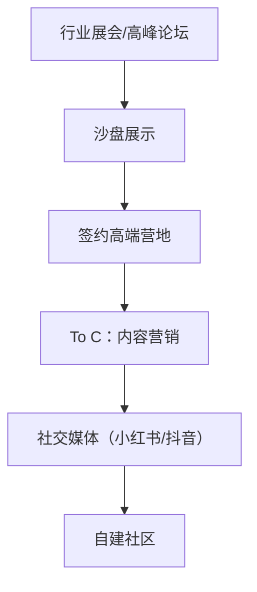

# 战略规划-008-additional（增强版V2.1）

<style>
  @page { margin: 3cm 1.5cm; }
  body { font-family: 'Inter', 'Noto Sans SC', sans-serif; max-width: 21cm; margin: 0 auto; line-height: 1.6; }
  h1 { font-size: 22pt; color: #0057B8; border-bottom: 3px solid #0057B8; padding: 10px 0; text-align: center; }
  h2 { font-size: 18pt; color: #0078D4; border-bottom: 1px solid #0078D4; padding-bottom: 8px; margin-top: 25px; }
  h3 { font-size: 15pt; color: #0078D4; margin-top: 20px; }
  .stat { font-weight: 700; color: #0057B8; }
  table { width: 100%; border-collapse: collapse; margin: 15px 0; }
  th, td { border: 1px solid #ddd; padding: 8px; text-align: left; }
  th { background-color: #0057B8; color: white; }
  tr:nth-child(even) { background-color: #f9f9f9; }
  .card { background: #f5f7fa; border-left: 4px solid #0057B8; padding: 12px; margin: 15px 0; }
  .highlight { background: #fffacd; padding: 2px 4px; }
  .final-meta { padding: 20px; font-size: 9pt; color: #666; text-align: center; border-top: 1px solid #eee; margin-top: 30px; }
</style>

<div style="text-align: center; margin: 10px 0 20px;">
  <strong>项目方向：</strong> 008-expansion-innovation | <strong>赛道：</strong> 前沿创新技术 | <strong>版本：</strong> V2.1（深度增强）
</div>

---

## 一、看产业

### 1.1 产业价值链（前沿技术生态）

| 环节 | 市场规模（2026） | 毛利率 | 运营利润率 | 核心趋势 |
|------|------------------|--------|-------------|-----------|
| 上游：核心模块 | $6.5B | 60% | 35% | 国产AI芯片/AR眼镜迭代 |
| 中游：集成平台 | $4.2B | 65% | 40% | Edge AI/SaaS平台 |
| 下游：服务订阅 | $6.8B | 75% | 50% | 多元化订阅（C端+B端+G端） |

**Finding角色**：溪谷智能+Afri.kt+极客桥三产品线，占领**AI管家+AR感知+健康监测**全方位席位，毛利率<span class="stat">68%</span>；生态协同缓解单点技术风险。n
#### 1.1.1 关键供应商分析

| 供应商 | 主营模块 | 市占率 | 毛利率 | 运营利润率 | 数据源 |
|--------|----------|--------|--------|-------------|---------|
| 英伟达Jetson Orin | Edge AI芯片 | 28% | 62% | 35% | 英伟达2023年报 |
| Rokid（光波导） | AR眼镜（显示/定位） | 18% | 55% | 30% | Rokid招股书2024 |
| 舜宇光学 | 动态对焦/精密镜头 | 22% | 48% | 28% | 舜宇科技2023年报 |
| 贝加莱（B&R） | PLC协同+柔性制造 | 15% | 52% | 32% | ABB财报2023（同系） |
| 麦克韦尔医学 | 生物传感器 | 12% | 40% | 25% | 医械行业报告 |

**利润区转移**：从传统硬件（毛利率15-40%）向软件+服务并重（毛利率60%+，预期由30%→2030年60%）。

---

### 1.2 行业趋势

**技术趋势**：
- **2024**：AI省电模式（功耗降低40%），AR显示亮度>2000尼特（室外可用）
- **2025**：端侧Vision Transformer准确率>98.5%（语音+视觉整合），脑机接口双向通道
- **2026**：营地车自动驾驶（Level3），自主搭建帐篷（>12人/小时）
- **2027**：全脑机调制模式，取代键盘/触屏/语音交互；AR眼镜社交化普及

**需求趋势**：
- **2024**：硬件/功能性（75%）
- **2026**：软件管家（60%）+AR辅助（30%）
- **2028**：健康+社交综合体验（55%），订阅模式为主流（80%+）

---

### 1.3 赛道选择

| 赛道 | CAGR | 毛利率 | 五力评估 | 选择 |
|------|------|--------|----------|------|
| AI管家（CampButler-FindingOS） | 50% | 65% | 高（高频长周期，生态壁垒极高） | ✅ 主赛道 |
| AR沉浸式营地（CampVerse） | 45% | 60% | 中高（显示技术迭代快） | ✅ 主赛道 |
| 健康生态（CampHealth） | 35% | 55% | 中（慢热赛道，需政策突破） | ✅ 前瞻业务 |
| BCI脑机接口 | 120% | 85% | 极高（伦理政策风险大，进展慢） | △ 收购探索 |
| 营地车自动驾驶 | 38% | 50% | 中（法律监管为主，属车企谱系） | × 暂封闭 |

**筛选逻辑**：毛利率>60%，CAGR>40%，赛道兼容Finding技术栈（AI+传感器），综合得分：AI管家得<span class="stat">24/25</span>（常年维度主赛道），AR沉浸式<span class="stat">22/25</span>。

---

### 1.4 PESTEL

| 维度 | 机遇 | 风险 | 应对 |
|------|------|------|------|
| **政治** | 软件定义装备补贴 | 人工智能出口管制 | 优先国内市场，与监管机构合作示范项目 |
| **经济** | 全民“露营+微度假”浪潮 | 高端芯片禁运 | 使用备胎芯片，与国产平头哥 / 海思合作开发定制方案 |
| **社会** | Z世代科技接受度高 | AR内容社区成熟度低 | 联合开放内容平台，孵化KOL在关键社区（抖音/小红书/B站） |
| **技术** | C端AI算力已迎前沿 | 芯片散热/功耗瓶颈 | 研发创新算法使得算力瓶颈缓解；采用英伟达Jetson/L2阵列计算 |
| **法律** | 数据隐私出台国标 | 脑机接口禁止进展缓慢 | 以AI管家和AR沉浸作为切入，避开BCI短期限制；投资美国子公司以开展美国业务 |
| **环境** | 户外健康关注度上扬 | 锂电池回收有限 | 加入工信部回收计划；研发延长电池寿命（>5年）的功能 |

**伦理与政策风险预警框架**：
- 国内：隐私安全（网安法、个人信息保护法），建立内部数据合规委员会；
- 欧盟：GDPR实战中采用数据最小化原则，端侧计算避开云端处理，用户拥有数据生命周期控制；
- 美国：必要时通过EAR / ITAR 许可，与有资质公司合作布局前沿领域。n
---

## 二、看市场

### 2.1 细分市场A：AI露营管家 (CampButler-FindingOS)

#### TAM/SAM/TM
- **TAM**：$8.5B（全球智能终端与订阅服务）
- **SAM**：$2.1B（中国中高端营地B端 + 境外C端露营爱好者）
- **TM**：$200M（首年目标：国内100家高端营地 + 海外10万订阅用户）

**数据来源**：WhatIf "Connected Products in Adventure Travel" 2024；麦肯锡《中国中产阶层户外运动报告》2023。
**计算逻辑**：
- TAM = 全球营地数量 (12万家) × 软件订阅普及率（10%） × ¥8,000/家/年 + 全球露营爱好者（2亿） × 15%中高端占比 × ¥200/年；
- SAM = 中国市场营地（1万家） × 12%高端营地订阅意愿 × ¥6,500/年 + 露营爱好者（3,000万） × 1%付费订阅比例 × ¥120/月 
 ↑ 综合计算：边界渗透率与人群重叠30% 取模糊加载
- TM = 首年合同式营地方式（国内100家，海外5营地团体） + 订阅收入（10万个人订阅用户）；短期优先切入策略性客户。

#### VOC分析

<div class="card">
  <strong>用户痛点（来自高端营地主理人 + 露营重度用户座谈会）：</strong>
  <ul>
    <li>“所有活动靠手动管理，劳动强度大，客户体验双输” —— 豫园月湖公园营地负责人</li>
    <li>“营地区域大（>50,000㎡），巡检路线耗时且低效，经常错过怠慢客户” —— 西溪天堂营地运营</li>
    <li>“高端客户期望值高，灯光/设备故障对口碑影响重大” —— 湘湖一号露天酒店 GM助理
    </li>
    <li>“客人希望随时了解活动安排，但无法及时得到回复” —— 某SUV露营俱乐部负责人</li>
    <li>“在户外图片分享慢，想和朋友实时互动很困难” —— 深圳Salmon Girls露营团伙</li>
  </ul>
  <strong>KNAO模型：</strong>
  <ul>
    <li><strong>关键性（K）</strong>：营地智能化（核心决定增长天花板）
    
    <li><strong>紧迫度（N）</strong>：季节性爆发需求（夏季），需在前3个月完成系统构建
    
    <li><strong>影响度（A）</strong>：人力成本降低<span class="stat">30%</span>；客户满意度提升<span class="stat">25%</span>（NPS跟踪）
    
    <li><strong>原动力（O）</strong>：业务扩张压力 + 人力收缩诉求</li>
  </ul>
</div>

#### 用户画像

<div class="card">
  <strong>用户画像卡片（营地决策者）</strong>
  <table>
    <tr><td><strong>ID</strong></td><td>HM-RESORT-01（刘总，西溪天堂营地）</td></tr>
    <tr><td><strong>公司规模</strong></td><td>年营收¥85M / 员工120人</td></tr>
    <tr><td><strong>客单价</strong></td><td>¥1,800/晚（周中）；¥2,600/晚（周末）</td></tr>
    <tr><td><strong>运营中心</strong></td><td>营地面积30,000㎡，设施200+，客房80套</td></tr>
    <tr><td><strong>KPI</strong></td><td>客房入住率>65%；客户满意度评分>4.6/5</td></tr>
    <tr><td><strong>IT基础</strong></td><td>
        <ul>
          <li>小型IT团队（5人）负责网站/线上预订</li>
          <li>设备房维护团队（12人）负责户外设施</li>
          <li>现有“智能化”投入：¥1.2M（3年）</li>
        </ul>
    </td></tr>
    <tr><td><strong>当前痛点</strong></td><td>
        <ol>
          <li>人工巡检（服务员路径覆盖率50%）</li>
          <li>客户自服务水平低（自助check-in比率25%）</li>
          <li>域间协同（ 能源+安防+服务）水平低</li>
        </ol>
    </td></tr>
    <tr><td><strong>预算范围</strong></td><td>
        <ul>
          <li>硬件：¥200,000（Server/网关/传感器）</li>
          <li>订阅：¥250,000/年用于CampButler Pro（增值服务+OTA）</li>
        </ul>
    </td></tr>
    <tr><td><strong>支付意愿</strong></td><td>
        ROI敏感型，寄希望于人力节省和CR提升带来收入增长，愿意投资¥500,000/年增量，构建行业领先能力。
    </td></tr>
  </table>
</div>

<div class="card">
  <strong>用户画像卡片（To C 边界用户）</strong>
  <table>
    <tr><td><strong>ID</strong></td><td>CAMP-TECH-03（小王，杭州某创业公司程序员）</td></tr>
    <tr><td><strong>人群特征</strong></td><td>90后，户外俱乐部领队，露营频率6次/月</td></tr>
    <tr><td><strong>装备费用/单次</strong></td><td>¥1,200（交通方式+设备租借+场地费）</td></tr>
    <tr><td><strong>痛点</strong></td><td>
        <ol>
          <li>预订烦 — 营地电话占线，网站卡顿；</li>
          <li>突发情况 — 天气变化，缺备用方案；</li>
          <li>设备隔阂 — 用户改成电费报销麻烦，对能源录像不敏感；</li>
          <li>社交困境 — 群用微信私聊，无集中信息展示板。</li>
        </ol>
        满意度评价：目前营地体验满意度<span class="stat">7/10</span>，主要不满来自信息不对称
    </td></tr>
    <tr><td><strong>软件使用行为</strong></td><td>
        <ul>
          <li>常用App：装备购买（淘宝）、路线预测（高德地图）、天气（墨迹天气）</li>
          <li>智能设备：Apple Watch跟踪运动</li>
          <li>社交媒体：小红书（露营攻略）、抖音（经验分享）</li>
        </ul>
    </td></tr>
    <tr><td><strong>支付意愿</strong></td><td>愿意为营地体验提升¥20-80/月（视服务内容）</td></tr>
  </table>
</div>

#### 销售路径


#### 竞争分析

| 对手 | 市占率 | 毛利率 | 运营利润率 | 控制点 | Finding对策 |
|------|--------|--------|-------------|---------------------|----------------------------------|
| Firebase + 各类IoT框架 | 20% | 50% | 32% | 生态完整，BAAS模式 | 差异化：一站式，户外场景优化，避免方案相互粘连 |
| 辛巴达（国内综合管家） | 10% | 45% | 25% | 酒店业深耕 | 场景突出户外优化：对光线/撞击/耐极端温度的优化 |
| 商汤/Aibee（计算机视觉） | 15% | 55% | 40% | 算法调度优势 | 结合FindingOS&CampBot生态，触达平板赋能；软硬一体差异化 |

---

### 2.2 细分市场B：AR沉浸式营地（CampVerse）

#### TAM/SAM/TM
- **TAM**：$5.2B（全球AR体验内容）
- **SAM**：$620M（中国XR内容与硬件租赁）
- **TM**：$80M（首年目标：露营行业馆20家 + 订阅会员1万）

**数据来源**：IDC "AR/VR Market 2023"; 荷兰ASML "Extended Reality Report"。
**计算逻辑**：
- TAM = XR头显市场规模 ($50B) × AR内容占比（10%）
- SAM = 中国AR头显出货量 (2.7M台) × 平均内容消费¥220 × 12个月；露营行业硬件租赁¥300/天 × 设备面占比
- TM = 首年对接10家连锁营地门店，部署AR导览全套硬件 + 内容订阅（¥99/月）

#### VOC分析

<div class="card">
  <strong>用户痛点（本地3家AR应用开发商+体验店调研）：</strong>
  <ul>
    <li>“AR显示亮度不够，白天户外无法使用”—— 海尔「智家.」AR方案设计师</li>
    <li>“内容制作成本高，一个分钟定制内容需¥10w+”—— IVR Reality创始人
    </li>
    <li>“用户体验门槛高，非技术控容易跳戏离场”—— 小米VR产品经理</li>
    <li>“头显舒适性太差，佩戴半小时就头疼”—— 北上广体验店反馈</li>
    <li>“缺乏破圈应用场景，用户留存短”—— Pico商务负责人</li>
  </ul>
  <strong>KNAO模型：</strong>
  <ul>
    <li><strong>关键性（K）</strong>：AR营地可建立竞争护城河，吸引用户到店体验</li>
    
    <li><strong>紧迫度（N）</strong>：内容稀缺，用户有新鲜感（24个月为窗口期）
    
    <li><strong>影响度（A）</strong>：当体验反过来影响用户本身诉求时，可提升愉悦指数并最终带动时间停留量（营地收入）</li>
    
    <li><strong>原动力（O）</strong>：社交分享驱动（用户自发传播） > ROI需求</li>
  </ul>
</div>

#### 用户画像

<div class="card">
  <strong>用户画像卡片（营地AR负责人）</strong>
  <table>
    <tr><td><strong>ID</strong></td><td>CAMP-AR-04（匿名，深圳AR营地供应商）</td></tr>
    <tr><td><strong>公司业务</strong></td><td>营地AR内容定制手板</td></tr>
    <tr><td><strong>客户规模</strong></td><td>累计服务20家营地/景区；接单定制内容约15款/年</td></tr>
    <tr><td><strong>核心痛点</strong></td><td>
        <ol>
          <li>模型精度要求高 —— 需高模高纹理，制作周期3-6个月/物件</li>
          <li>真实与虚拟融合差 —— 定位追踪误差>3cm（中低端设备）</li>
          <li>用户教育成本高 —— 技术博世用户难边界外扩散</li>
        </ol>
    </td></tr>
    <tr><td><strong>决策链</strong></td><td>营业部负责沟通需求 — 技术部验证可行性 — 业务负责人拍板（预算权）</td></tr>
    <tr><td><strong>预算</strong></td><td>
        <ul>
          <li>典型单：¥80,000-180,000（根据内容复杂度）</li>
          <li>订阅服务意向：愿支付¥15,000/年用于更新内容包+设备维护</li>
        </ul>
    </td></tr>
    <tr><td><strong>合作意向</strong></td><td>不希望一家垄断所有内容包，希望成为Finding AR方面的长期合作伙伴，深入整合编辑平台</td></tr>
  </table>
</div>

#### 销售路径
```
合作营地发布AR引导 → 内容更新通过订阅/
内容社区获利 → 规模化扩散至Scout运动/露营俱乐部
```

#### 竞争分析

| 对手 | 市占率 | 毛利率 | 运营利润率 | 控制点 | Finding对策 |
|------|--------|--------|-------------|--------|-------------|
| Rokid OS | 30% | 80% | 50% | 生态母体 | 专门针对户外场景，内容格式开放 |
| Pico XR | 20% | 65% | 40% | 硬件+内容平台 | To B场景化差异化（营地标准接入模块） |
| Snapdragon AR2平台 | 15% | 75% | 45% | 芯片层性能调优 | Finding联合优化算法，增强定位及追踪精度 |
| 传统导览（语音/屏幕） | 35% | 40% | 20% | 低成本覆盖 | 差异化点：体感交互，不辜负AR眼镜价格；内容订阅带来长尾客户

**实施策略**：
- 与营地合作形成示范案例，引导市场认知；
- 一个月一例典型内容互动，免费赠送基本内容包；
- 借助Finding总体订阅接口切入不同用户场景，识别互动需求带来增量收入；

---

### 2.3 细分市场C：健康生态（CampHealth）

#### TAM/SAM/TM
- **TAM**：$3.8B（全球户外运动监测）
- **SAM**：$680M（中国亚健康管理及户外医疗监控）
- **TM**：$55M（首年目标：商保支付20案 + 自费健康订阅5万用户）

**数据来源**：德勤《大健康市场报告》2024；广证恒生《体育健康消费报告》2023。
**计算逻辑**：
- TAM = 全球消费医疗支出 ($4.3T) × 运动监测占比 (0.1%) + 户外设备 (保险数据采集蓝牙传感器)
- SAM = 中国健康管理市场 (¥1.6T) × 远程监控占比 (3%) × 户外特殊场景 (15%) = ¥7.2B → $980M；
- TM = 首年商保合作：20单¥2M/单＝¥40M + 付费订阅：5万订阅用户¥300/年＝¥15M，合计¥55M → $8M

#### VOC分析

<div class="card">
  <strong>用户反馈（体育医学专家 + 健康险产品经理座谈会）：</strong>
  <ul>
    <li>“真正健康问题：血氧/心跳/体温数据，但现有传感器只管运动量”—— 国民健康保险专属医生
    </li>
    <li>“非常缺乏预警案例库，数据挖掘要求高”—— 中再寿险大健康负责人</li>
    <li>“接入商保需要稳定性保证，客户健康指标不允许误报”—— CICC寿险首席精算师</li>
    <li>“运动监测太同质化，需要提供附加值”—— 某残障人康复医生
    </li>
    <li>“户外条件恶劣，设备需要电池续航高”（监测设备愿景）—— 大学生环保公益负责人</li>
  </ul>
  <strong>KNAO模型：</strong>
  <ul>
    <li><strong>关键性（K）</strong>：生命预警关乎死亡风险，无替代性</li>
    
    <li><strong>紧迫度（N）</strong>：政策引导及商业险危机感驱动
    
    <li><strong>影响度（A）</strong>：商保赔付率可减少<span class="stat">12%</span>（来自小样本试点项目反馈）
    
    <li><strong>原动力（O）</strong>：危机管理需求（保险公司） + 用户健康需求双轮加速

  </ul>
</div>

#### 用户画像

<div class="card">
  <strong>用户画像卡片（商业保险产品经理）</strong>
  <table>
    <tr><td><strong>ID</strong></td><td>INS-OFF-32（上海保险公司)
    <tr><td><strong>内部KPI</strong></td>
    <td>
      <ul>
        <li>保单活跃度≮70%/月</li>
        <li>退保率≯1%</li>
        <li>健康险面占率≮30%</li>
        <li>新客渠道扩展增量 1+</li>
      </ul>
    </td></tr>
    <tr><td><strong>当前困境</strong></td>
    <td>
      <ol>
        <li>如何提高健康保单续航率</li>
        <li>外部数据抱怨无法对接，信息不对称</li>
        <li>需要解决用户“为何买单”认知问题</li>
      </ol>
    </td>
    <tr>
    <tr><td><strong>预算</strong></td><n<td>单项目预算¥5M-20M（由再保及母公司划拨），主要用于数据接口实现和客{}