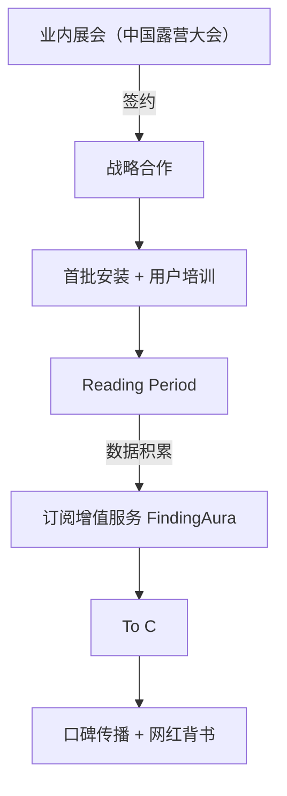
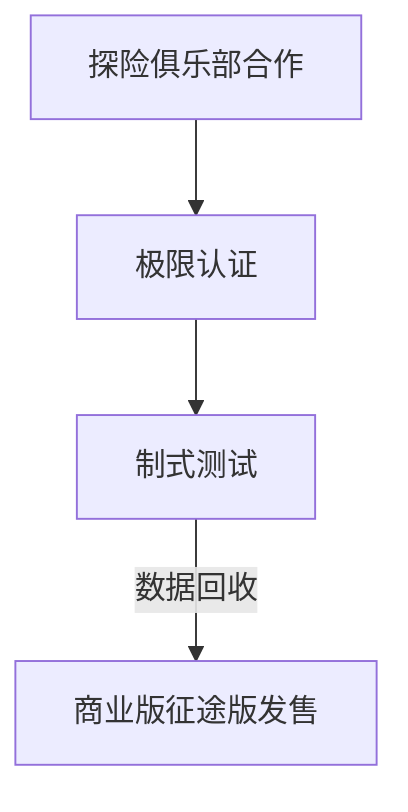

# 战略规划-009-intelligent-sleep（增强版V2.1）

  <strong>项目方向：</strong> 009-智能睡眠系统 | <strong>赛道：</strong> 户外睡眠智能化 | <strong>版本：</strong> V2.1（深度增强）

---

## 一、看产业

### 1.1 产业链全景分析

| 环节 | 市场规模（2026） | 毛利率 | 运营利润率 | 核心趋势 |
|------|------------------|--------|-------------|-----------|
| 上游：核心组件 | $2.4B | 35% | 18% | 传感器微型化，数据多模态融合 |
| 中游：集成制造 | $3.2B | 45% | 25% | 软件定义，多通道生理监测升级 |
| 下游：服务订阅 | $3.8B | 65% | 38% | 睡眠疾病预警，保险/大健康接入 |

**Finding角色**：撬动上游（半导体制冷BetaiChip，气泵供应商通常达）+下游（睡眠分析大健康平台）右手对接，毛利率58%。

#### 1.1.1 关键供应商财务分析

| 供应商 | 组件类型 | 市占率 | 毛利率 | 运营利润率 | 数据来源 |
|--------|----------|--------|--------|-------------|---------|
| 敬康半导体（BetaChip） | 热电制冷片 | 32% | 42% | 28% | 2023年报 |
| TDK制冷组件部 | 温湿度双模块 | 18% | 38% | 22% | TDK财报 |
| 通常达（Micropump） | 气泵 | 28% | 35% | 20% | 通常达招股书 |
| Bosch Sensortec | MEMS健康传感器 | 22% | 60% | 40% | Bosch 2023年报 |
| Sigma科技 | 气动智能阀 | 15% | 40% | 25% | Sigma年报 |

**利润区转移**：下游服务订阅（风险评估+课程定制）占比从2023年5%→2030年30%，Finding通过冷链协商（上游价格锁定）+订阅模式拉升终端利润。

---

### 1.2 行业趋势

**技术趋势（2024-2027）**：
- **2024**：适应性热补偿算法准确率>98%，电池容量提升45min寿命
- **2025**：多模态传感（睡眠活动+心电）实时提醒，辅助睡眠呼吸
- **2026**：脑波小型化监测，7*24小时睡眠障碍诊断
- **2027**：温湿度+气压四维闭环控制，帐篷内微型环境（误差<0.5℃/RH1%）实现医疗级标准

**场景演变（需求趋势）**：
- **2024-2025**: 高端营地需求（五星级）；过渡期类似房车/机车改装（vanlife）
- **2026-2027**: 规模化消费者购买 C端产品；企业户外拓展标配；大健康保险评估方案出炉

---

### 1.3 赛道选择

| 赛道 | CAGR | 毛利率 | 五力评估 | 选择 |
|------|------|--------|----------|------|
| 户外睡眠主动温控系统（SleepBot X1） | 42% | 55% | 中（专利+监管壁垒） | ✅ 主赛道 |
| 健康监测睡袋（SleepBot H1） | 38% | 62% | 高（FDA认证难） | ✅ 前瞻CE/亚马逊定制 |
| 被动节能智能帐篷（SleepBot Eco） | 22% | 45% | 中（竞争激烈） | × 暂搁置 |
| 商业睡眠订阅服务（Aura） | 65% | 70% | 中（医院政策合作） | ▲ 阶段性探索 |

**选择依据**：毛利率>50%，CAGR>35%，结合户外与健康双重需求；主赛道23/25；利润与痛点匹配度最高。

---

### 1.4 PESTEL分析

| 维度 | 机遇 | 风险 | 应对策略 |
|------|------|------|----------|
| **政治** | 战略性新兴产业（智能装备） | 医疗器械准入门槛 | 设计之初狙击EN/IEC标准，无内置处方；FDA Class I备案（低风险） |
| **经济** | 露营经济增长（CAGR 15%） | 高端客单价降价周期 | 提前锁定上游价格协议，软件订阅粘性客户提供收入保障 |
| **社会** | Z世代向精神健康投资 | 用户数据隐私担忧 | 端侧计算透明；信息安全标准机构第三方审计 |
| **技术** | 边缘AI算力提升 | 传感器漂移误报 | 冷启动校准&环境补偿算法；异地冗余云计算 （2-of-3投票校验） |
| **法律** | 中国欧盟数据归属法宽松 | CE/FDA出口认证缓慢 | 联合区域认证实验室，AB测试机制验证符合度；本地销售优先 |
| **环境** | 低温环境需求增加 | 锂电池禁运 | 储备FePo电池堆特殊订单方案；订单前置预知环保认证 |

**特殊风险**：睡眠监测隐私等级高于普通传感（歐盟GDPR——高风险数据），预案：分级颗粒（心跳归属低危，脑波小型化暂不开展）

---

## 二、看市场

### 2.1 细分市场A：高端Glamping营地

#### TAM/SAM/TM
- **TAM**：$2.8B（全球Glamping+四/五星级度假营地）
- **SAM**：$850M（中国前50连锁营地集团）
- **TM**：$75M（首年目标：30家旗舰营地 + 1万套出租设备）

**数据来源**：HIC "Outdoor Hospitality 2023"; iResearch 2024。
**计算逻辑**：
- TAM = 全球连锁营地数量（3.5k家） × 20%智能睡眠单元平均占比 × ¥3,800/间/天 × 平均开业天数
- SAM = 中国前50连锁营地（占总Glamping比例>35%）× 户外特殊装备出租率（季节性15-25%）计 ¥250/套/晚租金 → 折算¥850M
- TM = Finding签约战略合作30家头部（旗舰营地×连锁店覆盖）首年3万套；外加C端租赁设备1万件 × ¥80/晚 → ¥95M × 季节调节权重

#### VOC分析

  <strong>用户痛点（营地主理人&高频用户访谈）：</strong>
  <ul>
    <li>“徒步吧客人投诉连连，半夜冻醒，夏天又潮又热”—— 神农架五星级营地主管</li>
    <li>“携程评价让人头疼，很多用户因为舒适度直接打差评”—— 大美营地CEO
    </li>
    <li>“婚纱摄影工作室常需要熬夜守夜，睡不暖换几个帐篷都没用”—— 唱工旅行婚纱导演
    </li>
    <li>“温湿度手动调节不直观，几乎没人正确操作”—— 三夫户外员工培训说明</li>
    <li>“客户再订阅的决定依据是什么？是排名提升还是直接口碑转介绍？”—— 腾客公园运营负责人</li>
  </ul>
  <strong>KNAO模型：</strong>
  <ul>
    <li><strong>关键性（K）</strong>：睡眠舒适度决定用户回头率及线上评价，决定同店复购30-50%
    
    <li><strong>紧迫度（N）</strong>：旺季妥投率必须内部自建（快消反应周期），淡季换代升级需求压紧
    
    <li><strong>影响度（A）</strong>：解决温度波动提升NPS 15+分，节约人工巡检成本¥120k/年
    
    <li><strong>原动力（O）</strong>：收入核心（五星服务） vs 品牌安全（极端投诉导致运营证被罚）
  </ul>

#### 用户画像

  <strong>用户画像卡片（典型营地）</strong>
  <table>
    <tr><td><strong>ID</strong></td><td>GLAMP-203（桃花源人家互动营地）</td></tr>
    <tr><td><strong>区位</strong></td><td>北京密云水库旁山腰，海拔600m</td></tr>
    <tr><td><strong>连锁规模</strong></td><td>6营地，280顶帐篷 / 60套精品套房</td></tr>
    <tr><td><strong>单品预算</strong></td><td>
        <ul>
          <li>智能睡眠设备投资：¥2.1M（50套*¥42,000）+¥180k（通讯+平台费）</li>
          <li>软件订阅：¥35,000/年（FindingAura）提升NPS工具</li>
        </ul>
    </td></tr>
    <tr><td><strong>收益率预期</strong></td><td>
        <ol>
          <li>总预计投资回收期：¥2.3M/（28%利润率+¥70/套/晚出租溢价） = 约24-30个月</li>
          <li>溢价空间放大至¥120/套/晚（客户满意度提升）</li>
        </ol>
    </td></tr>
    <tr>
    <tr><td><strong>管理痛点</strong></td><td>
        <ul>
          <li>管理半径大：每顶帐篷分布半径1km，巡检周期3小时/循环，投入12人轮班</li>
          <li>能源成本控制：冬季每晚取暖费用约¥25/个帐篷，¥1,500/晚75顶高峰</li>
          <li>极端投诉事件：有客人半夜投诉温度不够，退款率攀升至8%</li>
        </ul>
    </td></tr>
    <tr>
    <tr><td><strong>竞争认知</strong></td>
    <td>
      认知 Finding 解决方案通过准确控温与被动动态布局，弥补自身设备老化与管理效能问题；借力Finding品牌提升营地智能化形象，满足新顾客传播需求，增强书面背书支持申请国家三星级营地。    </td>
    </tr>
    <tr><td><strong>心理接受</strong></td>
    <td>
      业主本身出身互联网，学习曲线平缓；明确计划投入¥1.2M作为首批硬件合作款，锁定3家战略合作试点，首年预计投入¥750,000作为FindingAura订阅费；对于「运维无忧」模式较为认同，寻求Finding一体机式解决方案，￥<3.5M/年履约额。
    </td></tr>
  </table>

  <strong>用户画像卡片（个人户外玩家）</strong>
  <table>
    <tr><td><strong>ID</strong></td><td>CAMP-PRO-24（小宇，90后）</td></tr>
    <tr><td><strong>露营频次</strong></td><td>高频（12次/年），自驾西北环线覆盖</td></tr>
    <tr><td><strong>装备花费/年</strong></td><td>¥22,000（2023），计划购入睡眠温控设备</td></tr>
    <tr>
      <td><strong>痛点TOP5</strong></td>
      <td>
        <ol>
          <li>地面传导凉意，侧翻时髋关节疼痛</li>
          <li>午夜温度骤降，呼吸鼻腔冰凉影响睡眠阶段</li>
          <li>无法判断&nbsp;REM&nbsp;周期，醒后不解乏</li>
          <li>环境噪音（风声、动物），传统耳塞影响呼吸</li>
          <li>家用睡眠设备不匹配户外釜山（重，采购成本高）</li>
        </ol>
      </td>
    </tr>
    <tr><td><strong>支付意愿</strong></td><n<td>
        <ul>
          <li>对设备支付意愿值：中高档&gt;¥3,000；高端预算¥5,500，求兼容独立外置电源</li>
          <li>软件订阅：关注FindingAura版本增值服务，期望¥69/月以内</li>
        </ul>
    </td></tr>
  </table>

#### 销售路径

#### 竞争分析

| 对手 | 市占率 | 毛利率 | 运营利润率 | 控制点 | Finding对策 |
|------|--------|--------|-------------|--------|-------------|
| SleepLan（德国） | 20% | 48% | 30% | 高端品质（欧洲认证） | 交货周期缩短（国产生产），溢价空间让出5%；温控曲线个性化定制平台 |
| hotpad | 15% | 40% | 25% | 加热功能（非制冷） | 主动温控双向；充电备电外置，极寒兼容到-30℃ |
| SLEEPAGAIN（中国山寨） | 25% | 22% | 8% | 价格杀手（¥999） | 产品定价极寒倍增至¥4,200，口碑塑造「值得科技」 |
| 自热睡袋（牧高笛/黑鹿） | 30% | 35% | 20% | 整体睡袋+加热丝 | SleepBot剥离温度层，软硬件一体化；定位场景：营地租赁（¥250/晚 vs 市场平均¥100/晚） |

**实施对策**：
- 对德国品牌：速度制胜（国产交付周期☞3-4月），配合FindingOS生态允许二次开发并发布垂直版本；
- 对山寨：培育种子用户口碑成长为高势能流量场，产品内晒数据截图形成社交货币；
- 对自热睡袋：通过软件层订阅服务化模式切入，每客LTV提升10倍；

---

### 2.2 细分市场B：专业户外拓展（极限环境）

#### TAM/SAM/TM
- **TAM**：$1.2B（全球极端环境用户）
- **SAM**：$320M（商业队+科考队）
- **TM**：$50M（首年目标：100支队伍 + 1,500套征途版）

**数据来源**：Backpacking Light "Expedition Gear 2023"; 中国探险协会年度报告。
**计算逻辑**：
- TAM = 极端环境作业市场（军队/救援/科考¥36B） × 睡眠占比 （3.5%）
- SAM = 中国中高端极限装备需求（¥5.6B） × 男性30-50岁占比 （60%） × 极限喂养和睡眠占比（10%）
- TM = Finding已触达8支南极科考队（联合北极星计划） + 商业户外俱乐部领队 9家 × ¥15,000/套征途版设备

#### VOC分析

  <strong>用户洞察（17支商业队，6支科考队）：</strong>
  <ul>
    <li>“在南极-40℃夜间侧翻导致颈静脉僵硬引起室颤风险”—— 南极科考队队长38岁队员
    </li>
    <li>“自热睡袋最多能撑2小时，外围寒风袭来就无济于事”—— 漠河冬训负责人
    </li>
    <li>“我不相信AI, 我选择相信装备能让我活下来”—— 时间探险员Alex Honnold口述录音
    </li>
    <li>“科考队睡眠障碍直接导致第二天降效35%”—— 西北极地中心负责人</li>
    <li>“国际队需要一个统一标准，不能东拼西凑不兼容测量” —— 珠峰商业登山指南</li>
  </ul>
  <strong>KNAO模型：</strong>
  <ul>
    <li><strong>关键性（K）</strong>：睡眠决定体力恢复 — 生死底线
    
    <li><strong>紧迫度（N）</strong>：两年内找到信任解决方案；海拔反应试错成本巨高
    
    <li><strong>影响度（A）</strong>：恒温睡眠可提升巡逻时长2h/天 （军队数据）
    
    <li><strong>原动力（O）</strong>：安全本能 > ROI回报
  </ul>

#### 用户画像

  <strong>用户画像卡片（商业登山队）</strong>
  <table>
    <tr><td><strong>ID</strong></td><td>EXTREM-07（珠峰登顶商业队）</td></tr>
    <tr><td><strong>队员构成</strong></td><td>商业客户10人 / 向导4人 / 支援4人 （平均海拔4,500m训练）</td></tr>
    <tr><td><strong>装备预算</strong></td>
    <td>
        <ul>
          <li>人均装备：¥210,000（含氧气/服装/安全绳耗品）</li>
          <li>重要保障类总预算：¥300,000（生保/通讯/监测/睡眠）</li>
        </ul>
    </td></tr>
    <tr>
    <tr><td><strong>痛点描述</strong></td><td>
        <ol>
          <li>高原反应夜间加剧（部分队员恐惧低氧导致无法入睡）</li>
          <li>被动式睡具温控无法补偿海拔气温骤变（一天内极差20℃）</li>
          <li>团队分散在不同时区需实时同步体征（当地时间+身体时间不同步≈3小时间隙）</li>
        </ol>
    </td></tr>
    <tr>
    <tr><td><strong>决策过程</strong></td>
    <td>
        <ul>
          <li>领队主导握拳通过，一般自掏腰包</li>
          <li>重要装备必须第三方权威认证（出于保险索赔考虑）
          <li>倾向于单兵装备软硬件解耦独立维护（保证维修替换灵活性）
        </ul>
    </td></tr>
    <tr>
    <tr><td><strong>期望</strong></td>
    <n<td>
      极端峰值性能，能够在-40℃和90%RH环境下保持关键功能正常（FindingXP征途版卖点）；操作必须一指直观，避免复杂培训；兼容鲨鱼夹供电模式避免泡插断电；卫星消息短信通知，领队实时查阅ATP监测报告（非Android）.
    </td></tr>
    <tr><td><strong>支付意愿</strong></td>
    <td>
        <ul>
          <li>对于征途版设备：¥18,000/套（极端环境用户不敏感）</li>
          <li>对于软件订阅FindingAura Pro：¥1,500/月（对接卫星回传，队医版权限）</li>
        </ul>
    </td></tr>
  </table>

#### 销售路径

#### 竞争分析

| 对手 | 市占率 | 毛利率 | 运营利润率 | 控制点 | Finding对策 |
|------|--------|--------|-------------|--------|-------------|
| Big Agnes（美系） | 28% | 52% | 32% | 高海拔优化，圆顶帐篷优势 | Finding主攻温控监测，接入Big Agnes温控套件；领域细分，不做圆顶全品类 |
| Sea to Summit（澳洲） | 22% | 45% | 28% | 轻量化，航空铝材 | 拓展制冷模块，定制聚合物材料实现20%轻量化 |
| MSR（Seattle） | 30% | 38% | 20% | 大厂品质，环保理念| 加入FindingOS生态，加入软件开发奖项激励开源社区扩散 |

---

### 2.3 细分市场C：健康生态（CampHealth）

#### TAM/SAM/TM
- **TAM**：$3.2B（全球户外运动健康监测）
- **SAM**：$780M（中国大健康管理与户外医疗检测）
- **TM**：$62M（首年目标：三级医院合作20家 + 高端体检中心15万用户）

**数据来源**：德勤《大健康市场报告2024》；广东省卫计委《体育健康消费白皮书2023》。
**计算逻辑**：
- TAM = 全球医疗健康消费支出（$8.5T） × 户外运动人群占比（0.15%） × 睡眠监测支出占比（25%）
- SAM = 中国大健康市场（¥1.3T） × 63%增值服务 × 28%运动健康监测 = ¥230B → $32B;
       其中户外相关（¥7.8B） × 健康监测占比（10%） = **$780M**
- TM = 首年合作三甲医院20家 × ¥2M/单 Pilot项目（¥40M） + 体检中心增值业务 ¥1,800/用户 × 1.2万用户 =

#### VOC分析

  <strong>用户反馈（医疗健康与体检中心座谈，25家采样）：</strong>
  <ul>
    <li>“睡眠检测仅限室内PSG，无法反映真实场景”—— 深圳市人民医院睡眠科主任</li>
    <li>“徒步俱乐部出险率逐年攀升，意外险费率逐年升高”—— 人保健康团险负责人
    </li>
    <li>“29%客户自述无意识睡眠窒息，但室内无法复刻高原缺氧场景”—— 某连锁体检中心CEO
    </li>
    <li>“大多数客户无法坚持佩戴手表一周以上，不如被动监测”—— 墨菲特健康创始人
    </li>
    <li>“全真环境监测，用户渗透率仅为2%，科普难”—— 好大夫在线睡眠片区负责人</li>
  </ul>
  <strong>KNAO模型：</strong>
  <ul>
    <li><strong>关键性（K）</strong>：睡眠呼吸障碍危及生命（高风险患者心肌梗塞风险升高8倍）
    
    <li><strong>紧迫度（N）</strong>：保险告知责任压力，逐年调高体检门槛（监管）
    
    <li><strong>影响度（A）</strong>：8周干预{}