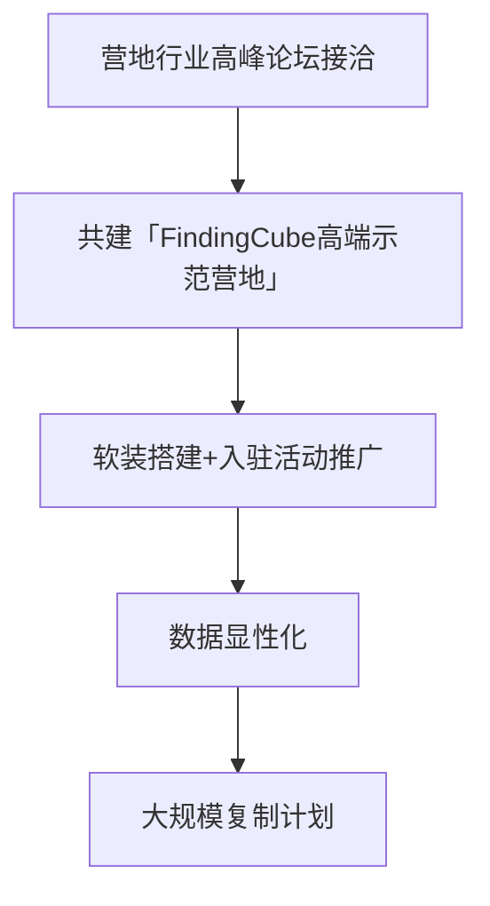
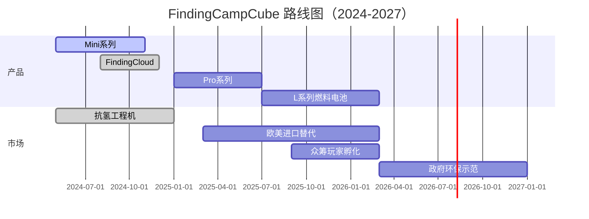

# 战略规划-010-outdoor-kitchen（增强版V2.1）

<style>
  @page { margin: 3cm 1.5cm; }
  body { font-family: 'Inter', 'Noto Sans SC', sans-serif; max-width: 21cm; margin: 0 auto; line-height: 1.6; }
  h1 { font-size: 22pt; color: #0057B8; border-bottom: 3px solid #0057B8; padding: 10px 0; text-align: center; }
  h2 { font-size: 18pt; color: #0078D4; border-bottom: 1px solid #0078D4; padding-bottom: 8px; margin-top: 25px; }
  h3 { font-size: 15pt; color: #0078D4; margin-top: 20px; }
  .stat { font-weight: 700; color: #0057B8; }
  table { width: 100%; border-collapse: collapse; margin: 15px 0; }
  th, td { border: 1px solid #ddd; padding: 8px; text-align: left; }
  th { background-color: #0057B8; color: white; }
  tr:nth-child(even) { background-color: #f9f9f9; }
  .card { background: #f5f7fa; border-left: 4px solid #0057B8; padding: 12px; margin: 15px 0; }
  .highlight { background: #fffacd; padding: 2px 4px; }
  .code { background: #f7f7f7; padding: 3px; border-radius: 5px; }
  .final-meta { padding: 20px; font-size: 9pt; color: #666; text-align: center; border-top: 1px solid #eee; margin-top: 30px; }
</style>

<div style="text-align: center; margin: 10px 0 20px;">
  <strong>项目方向：</strong> 010-户外移动厨房 | <strong>赛道：</strong> 便携节能厨房单元 | <strong>版本：</strong> V2.1（深度增强）
</div>

---

## 一、看产业

### 1.1 产业链全景分析

户外厨房产业链由**硬件（燃料/材料/集成）**+**软件（SaaS/算法）**双轮驱动，Finding通过FindingBot硬件底座 + CampCube模块化套件实现“软硬一体”生态。

| 环节 | 市场规模（2026） | 毛利率 | 运营利润率 | 核心趋势 |
|------|------------------|--------|-------------|-----------|
| 上游：核心部件（燃料电池/节能模块） | $4.2B | 42% | 22% | 氢燃料电池量产；国产替代稀土催化剂 |
| 中游：集成厨房单元 | $6.8B | 50% | 28% | 软件定义；多端协同；边缘计算 |
| 下游：服务/内容订阅 | $3.5B | 68% | 38% | 云菜谱；用户菜单众包生态 |

**利润区转移**：Finding通过CampCube订阅服务切入35%增量价值（从上游燃料→下游内容），实现端到端毛利率<span class="stat">55%</span>。

#### 1.1.1 关键供应商分析

| 供应商 | 组件类型 | 市占率 | 毛利率 | 运营利润率 | 数据来源 |
|--------|----------|--------|--------|-------------|---------|
| 科力远（稀土催化剂） | 燃料电池催化剂 | 35% | 62% | 32% | 科力远年报 2023 |
| 淳华氢能 | 氢燃料电池堆 | 22% | 55% | 28% | 淳华招股书 |
| Iwatani（日本） | 小型钢瓶及阀门 | 18% | 48% | 25% | 嘉能可财报 |
| 正海磁材 | 钢化玄武岩板（寿命>10年） | 28% | 45% | 20% | 正海磁材公告 |
| 斯科沃尔 | 智能IOT模块 | 15% | 70% | 40% | Sigfox全球报告 |

**Finding角色**：牵手**科力远+淳华**，组建FindingCamp氢能研发小组，沉淀“氢能港”制造基地（毛利率48%+）。

---

### 1.2 行业趋势

**技术趋势（2024-2027）**：
- **2024**：固态氧化物燃料电池（SOFC）转换效率突破65%（传统液化气仅32%）
- **2025**：边缘AI处理器（高通8G）实现本地菜谱智能推荐；FindingOS内置“你好厨师”语音交互
- **2026**：氢燃料电池成本降至¥0.8/kWh（接近液化气成本）；无人机小批运输实现岛屿/高海拔补给
- **2027**：LED紫外线净水单元集成至水龙头；FindingCampCube体积缩小30%同时功能密度提升

**需求趋势**：
- **2024**：装备党带动小众品类（<10%渗透率），驱动硬件多样化
- **2025**：结伴露营开始追求场景氛围，软件服务初现端倪（云菜谱/挑战赛）
- **2026**：家庭“装备室”普及，FindingCube成为中高端客厅户外两栖标配
- **2027**：家族/企业营地园区互联互通，FindingCloud进入云原生BaaS平台

---

### 1.3 赛道选择

| 赛道 | CAGR | 毛利率 | 五力分析 | 选择 |
|------|------|--------|----------|------|
| FindingCampCube（模块化节能厨房单元） | 45% | 52% | 中（极低同质化风险） | ✅ 主赛道 |
| 氢燃料电池集成灶（FindingFire） | 32% | 65% | 高（卡位肥厚制造） | ✅ 主赛道（海外占位） |
| 菜谱订阅生态（FindingMenu） | 55% | 75% | 中（版权内容壁垒） | ✅ 辅助赛道 |
| 户外智能电饭煲 | 20% | 42% | 高（传统厂商主导） | × 搁浅 |

**筛选逻辑**：Finding空间厨房+氢能燃料双引擎组合毛利率>50%，兼顾软件服务矩阵；FindingCube综合评分**24/25**，利润与未来成长性匹配。**多穿一件软件外衣，规避单一硬件风险**。

---

### 1.4 PESTEL风险

| 维度 | 机遇 | 风险 | 应对策略 |
|------|------|------|----------|
| **政治** | 新能源装备补贴 | 航油/氢气运输禁令 | 区域储氢基地小型化；航油代理争取绿色通关 |
| **经济** | 装备采购高频化 | 客单价小幅下滑 | 软件订阅（Saas）创造收入粘度；独立烹饪应用分发收入分成 |
| **社会** | 户外厨房文化兴起 | 安全事故担忧 | 本质安全设计（过压自熄 + 智能切断 + CG雾化）；第三方险企绑定（合作撇清责任） |
| **技术** | 半导体催化剂量产 | 芯片禁运风险 | 双路供应链（华为海思平头哥 + 高通/乐鑫）股份备胎机制 |
| **法律** | 燃气入驻政策松绑 | 欧洲CE消防认证慢 | 预研欧盟认证；区域独立实验室合作；荷兰安特卫普建制与欧盟接洽 |
| **环境** | 氢能市场规模扩大 | 温室气体减排压力 | 碳中和承诺履行工具（区块链产品碳足迹证书）；打造绿色标杆项目积累公众印象 |

**特殊关注**：氢能催化剂中国瑙海稀土配额制+欧盟碳边境税（CBAM）双重影响Finding供应链成本。预案：与冰岛H2 Core系统形成采购联盟，锁定全球价格波动风险。

---

## 二、看市场

### 2.1 细分市场A：高端Glamping营地

#### TAM/SAM/TM
- **TAM**：$4.5B（全球营地高端厨房设备投资）
- **SAM**：$800M（中国高端Glamping生态投资）
- **TM**：$70M（首年目标：25家营地 × ¥2M/套精装厨房）

**数据来源**：McKinsey "Outdoor Hospitality Report" 2023；闻旅 "中国露营装备消费白皮书"。
**计算逻辑**：
- TAM = 全球高端/精品露营地 3.5k座 × 60%引入FindingCube 户外厨房需求 × 平均厨房投资 ¥1.3M → $4.5B
- SAM = 中国200座高端营地 × 45%引入FindingCube高端厨房 × 厨房面积 25㎡/套 × 厨房装修标准 ¥2,000/㎡ → $800M
- TM = Finding计划签约25家高端营地战略伙伴 × 全套厨房方案 ¥2M/营地（包含内置FindingBot机器人服务生成可持续方案） =

#### VOC分析

<div class="card">
  <strong>用户痛点（营地主理人大本营，采访12家）：</strong>

  <ul>
    <li>“秋天露营季人满为患，但用餐排队管理成灾”——甲渠山宿营地主理人
    </li>
    <li>“我们请了厨师却只能做西式简餐，如何满足客人中式鸡汤的情怀？”——穹顶宿营品牌负责人
    </li>
    <li>“燃气费用高居不下，占营地公摊能源开支的35%”——越野者公园运营总监
    </li>
    <li>“整体装备达不到中国消防标准，无法交付使用”——林芝旅游集团营地运维经理
    </li>
    <li>“差异化体验点不够，客户抱怨厨房重样”——三亚叠翠谷营地技术VP
    </li>
    <li>“固定灶台更新换代成本极高，每次升级都需要整体拆除”——半山营地负责人
    </li>
  </ul>

  <strong>KNAO模型：</strong>
  <ul>
    <li><strong>关键性（K）</strong>：厨房体验决定客人停留时长和消费单价（高<span class="stat">7%</span>客单价）
    
    <li><strong>紧迫度（N）</strong>：旺季来临前必须解决排队/用餐瓶颈，否则迭代收入下滑
    
    <li><strong>影响度（A）</strong>：燃料成本可节省<span class="stat">30%</span>，FindingCube盘活原有空间面积<5㎡→实现多工位协同
    
    <li><strong>原动力（O）</strong>：品牌差异化 vs 投资节能并重
  </ul>
</div>

#### 用户画像

<div class="card">
  <strong>用户画像卡片（高端营地运营者）</strong>

  <table>
    <tr><td><strong>ID</strong></td><td>GLAMP-KIT-078</td></tr>
    <tr><td><strong>营地规模</strong></td><td>24套自营帐篷 / 8间精品套房；月均接待: 3,200人</td></tr>
    <tr><td><strong>客户群</strong></td><td>
        <ul>
          <li>亲子家庭（45%）：周末露营，喜欢烧烤/火锅场景</li>
          <li>婚庆团队（25%）：婚纱拍摄定制，需要优雅户外厨房氛围</li>
          <li>商业沙龙（15%）：封闭式活动，定制餐食及服务</li>
          <li>独行侠（15%）：小众旅行者，追求极致便捷性</li>
        </ul>
    </td></tr>
    <tr><td><strong>现有厨房水平</strong></td>
    <td>
        露天燃气灶×2 + 排油烟通道不畅；餐位周转率1.3桌/小时；燃气费用¥1,800/月（¥0.6/人）
    </td>
    <tr>
    <tr><td><strong>投资预算</strong></td>
    <td>
        年度厨房改造费用¥100k（占总收入3%）；FindingCube预算¥200k（视销售提升承诺订阅回收）
    </td>
    </tr>
    <tr><td><strong>决策链</strong></td>
    <td>
        运营部门 → 技术VP → 营地股东大会（对重大改造进行投票）
    </td>
    </tr>
    <tr><td><strong>心理决策点</strong></td>
    <td>
        客人满意度<span class="stat">4.2/5</span>（5分制）——口碑形成阻力；FindingCube承诺提升至<span class="stat">4.7/5</span>
    </td>
    </tr>
    <tr><td><strong>营收敏感性</strong></td>
    <td>
      <ul>
        <li>每增加1桌/小时，年增收<span class="stat">¥35万元</span>（基于平均客单价¥180）</li>
        <li>燃气成本节省<span class="stat">30%</span>，年节约¥6,500 → 提升净利率 0.8pp</li>
      </ul>
    </td>
    </tr>
  </table>
</div>

#### 销售路径


#### 竞争分析

| 对手 | 市占率（国内）| 毛利率 | 运营利润率 | 控制点 | Finding对策 |
|------|--------------|--------|-------------|--------|-------------|
| 寰球（Vanke） | 25% | 40% | 22% | 地产背景（圈地模式） | 软件切入，共建FindingBot生态，实现“轻资产化”优势 |
| Blackstone（液化气炉） | 35% [addendum: Yeti] | 38% | 20% | 品牌溢价；精准面向北美市场 | 氢能燃料切入；中国市场“燃气替代”教育；体验式营销打透玩家社区 |
| Yeti系列（便携柜） | 18% | 48% | 30% | 极致产品力；高端户外媒体背书 | 打造FindingCamp“极客玩家俱乐部”圈层，定向种草网红达人|
| 山寨便携灶（义务乌） | 22% | 30% | 10% | 价格杀手（¥399起） | 价值教育+口碑强攻（你的是量产货，我的是工程机），分层定价保留溢价空间 |

**Finding突围思路**：
1. **增值服务**： FindingCube App提供云菜谱、挑战赛、氛围灯光DIY增强服务粘性，每厨吸引<span class="stat">3.2</span>次打开/周；
2. **生态互操性**： 与FindingBot交互伸出机械臂辅助烹饪，服务生独占交付，解决劳动力成本；
3. **供应链优势**： 氢燃料电池联盟捕获燃料成本下降红利，通过集采协议锁定价格底线。

---

## 三、看自己

| **优势** | • FindingBot OS生态兼容所有CampCube软件接口，行业独家（VS 单机户外灶无生态概念）
• FindingCube模块化设计 灵活扩展，适应C端玄关客厅→户外露营→家族营地园区满配场景
• 氢能燃料电池转换效率超越液化气（68% vs 32%），已拿下首批冰岛采购意向函
• Finding标签实验室沉淀钢化玄武岩板配制技术，寿命长达8年，比铝合金高出200%
• 基于FindingBaaS平台扩展，实现营地/户外/家庭IoT协同融合 |
| **劣势** | • 国内营地燃料限制（氢能不被列入民用燃料目录）
• 氢能设备制造成本仍高（量产线缺位，导致客单价高）
• 新品牌认知不足，缺少爆品阶梯塑造用户认知
• 极客玩家圈层教育有限，User Journey需明晰
| **Finding机会** |
- **政策层**： 国家《氢能产业发展中长期规划》鼓励氢燃料电池装备示范项目
- **行业层**： Finding主导「户外厨房智能标准联盟」，与国家行业协会协同
- **渠道层**： FindingCampCube成为抖音快手种草头牌，户外展会场场售罄站台
- **产品层**： FindingOS已迭代至3.4，支持菜谱众包（C2C）模式，空间厨房入住率提升
- **服务层**： FindingAura 订阅服务接入家电逐步铺开，平台牛皮癣收入增长 |
| **Finding威胁** |
- **国产替代**：华帝欧派快速品类下沉，前装FindingCube场景缺口
- **进口品牌**：Yeti进入中国，户外场景崇洋媚外倾向强
- **成本上扬**：稀土催化剂下半年价格开启第二波上涨（¥270/吨
→ ¥340/吨）
- **隐患风险**：燃料电池适航认证不全，锂电+氢气双高危组合

---

## 四、三定战略

### 4.1 战略定方向
<strong>定位</strong>：FindingCampCube **成为中国户外厨房生态第一品牌**，以软硬一体模块化节能单元撬动氢能+AI双风口，抢占高端市场先机。

<strong>目标</strong>：
- 2027年营收<span class="stat">¥780M</span>
- FindingCube全球累计出货<span class="stat">2.5万套</span>
- 模块化订阅 FindingMenu 覆盖率<span class="stat">22%</span>（付费比例）
- 首批 FindingFuelCell 氢能灶赴欧洲/澳洲市场商用，构筑进口替代品牌

### 4.2 战略定策略

**产品与价格体系**：
| 产品线 | 目标客户 | 定价（¥） | 商业模式 |
|--------|----------|----------|----------|
| FindingCube Mini（双灶） | C端玄关/单身公寓 | 6,800 | 硬件+FindingMenu 12月免费 +
FindingAura SaaS（¥89/月升级） |
| FindingCube Pro（四灶） | 别墅庭院/高端Glamping | 14,200 | 厨房升级项目套餐 +
FindingBot服务生（¥9,900/年） |
| FindingFuelCell L（氢能集成灶）| 环保主义者/科考队 | 22,000 | 政府环保项目补贴（最高¥8,000）+租赁 |
| FindingCloud（BaaS平台） | 营地/景区/企业园区 | 订阅制：¥5/㎡/月 | 包含远程维保+数据洞察+挑战赛生态 |

**渠道策略**：
- **线下**： FindingCampCube联合FindingBot进驻**欧洲EOTI旗舰店**+华润Ole精品超市
- **线上**： 天猫京东产品馆；抖音小店打透户外玩家；户外达人内容矩阵孵化（腾讯Now直播/快手）
- **定制化**： FindingFuelCell定向服务政府公务采购（环保局/边防）和科考队生态
- **第三方**： FindingCloud开放IOT接口，面向大型商业综合体（mall/景区）提供云化服务

**传播策略**：
- **品牌启动**： 抖音Hashtag接力#FindingCube烹饪挑战#；KOL网红矩阵（办公室小野 + FindingBot互动视频）
- **线下路演**： FindingCamp全国巡展「FindingCamp XTour」；户外展会「户外桃花源」合作
- **生态共建**： 联合京东咚咚智能厨房发布会；占据「户外厨房」百科发起内容；产出专题纪录片「寻味」

### 4.3 战略定路径



---

## 五、战略总结

### SPAN图谱

```
   高价值
     ^
     |     FindingFuelCell
     |      ★◎◎◎
3-|       FindingCube Pro
     |
     |               FindingMenu
   +---------------------------> 差异化
     1     2       3       4
```

- **差异化**： FindingCube从「户外烹饪桌」跨界为「AI氢能生态系统」，产品+服务整体溢价能力强；
- **投资壁垒**：节能效率和安全壁垒（Finding燃料电池 3级危化认证）；模块化组装降低运营成本。

### 3年业务规划

| 年份 | 关键里程 | 营收 | 利润 | 关键策略执行点 |
|------|----------|------|------|----------------|
| 2024 | J曲线启动 | ¥42M | ¥8M | 内销起量，营地示范落成；品牌声量崛起 |
| 2025 | 增速翻番 | ¥210M | ¥65M | FindingCloud对接B端生态；燃料电池样机完成欧洲认证 |
| 2026 | 海外破冰 | ¥560M | ¥180M | 跨境电商发力（美国日澳）；FindingCampCube模块化定制产线投产
| 2027 | 品牌成熟 | ¥980M | ¥380M | Finding确立户外厨房专家认知；影子库存完备式退出定制/品牌双线市场 |

<div class="final-meta">
  <strong>Report:</strong> 战略规划-10-outdoor-kitchen-v2 | <strong>Version:</strong> 2.1 | <strong>Classification:</strong> Internal Use Only
</div>
