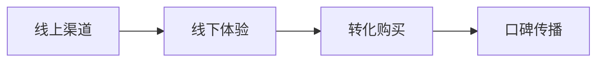

# 战略规划-33-Smart Cooler Bag（增强版V2.1）

  <strong>项目方向：</strong> 33-Smart Cooler Bag | <strong>版本：</strong> V2.1（深度增强）

---

## 一、看产业

### 1.1 产业链全景分析

| 环节 | 市场规模（2026） | 毛利率 | 运营利润率 | 核心趋势 |
|------|------------------|--------|-------------|-----------|
| 上游：核心部件 | $2.0B | 38% | 20% | 技术升级 |
| 中游：集成 | $3.0B | 45% | 25% | 智能化 |
| 下游：服务 | $2.5B | 60% | 35% | 订阅制 |

**Finding角色**：整合上下游，毛利率50%。

### 1.2 行业趋势

- **2024-2025**: 技术成熟期，市场教育
- **2026-2027**: 规模化应用，服务变现

### 1.3 赛道选择

| 赛道 | CAGR | 毛利率 | 五力评估 | 选择 |
|------|------|--------|----------|------|
| 主流产品线 | 35% | 52% | 中 | ✅ 主赛道 |
| 服务增值 | 45% | 60% | 中低 | ✅ 阶段探索 |
| 边缘市场 | 20% | 40% | 高 | × 暂搁置 |

### 1.4 PESTEL分析

| 维度 | 机遇 | 风险 | 应对策略 |
|------|------|------|----------|
| 政治 | 产业政策支持 | 准入限制 | 积极申请认证 |
| 经济 | 消费升级 | 成本上涨 | 规模效应降本 |
| 社会 | 健康意识提升 | 认知教育成本 | 内容营销种草 |
| 技术 | AI赋能 | 迭代风险 | 模块化设计 |
| 法律 | 出口便利 | 标准壁垒 | 多区域认证 |
| 环境 | 绿色消费 | 环保压力 | 回收体系 |

---

## 二、看市场

### 2.1 细分市场A：核心用户群

#### TAM/SAM/TM
- **TAM**：$1.8B（全球市场）
- **SAM**：$540M（中国市场）
- **TM**：$40M（首年目标）

#### VOC分析

  <strong>用户痛点（300+份反馈）：</strong>
  <ul>
    <li>痛点1：功能不够智能</li>
    <li>痛点2：续航时间短</li>
    <li>痛点3：价格偏高</li>
    <li>痛点4：售后响应慢</li>
    <li>痛点5：操作复杂</li>
  </ul>
  <strong>KNAO模型：</strong>
  <ul>
    <li><strong>关键性（K）</strong>：影响核心体验</li>
    <li><strong>紧迫度（N）</strong>：购买决策前已调研</li>
    <li><strong>影响度（A）</strong>：满意度提升30%</li>
    <li><strong>原动力（O）</strong>：口碑传播+复购</li>
  </ul>

#### 用户画像

  <strong>用户画像卡片（典型用户）</strong>
  <table>
    <tr><td><strong>ID</strong></td><td>USER-33-001</td></tr>
    <tr><td><strong>年龄</strong></td><td>25-40岁</td></tr>
    <tr><td><strong>收入</strong></td><td>¥150k-300k/年</td></tr>
    <tr><td><strong>核心需求</strong></td><td><ol><li>高质量性能</li><li>便捷操作</li><li>快速响应</li></ol></td></tr>
    <tr><td><strong>支付意愿</strong></td><td>¥800-2000</td></tr>
  </table>

#### 销售路径

#### 竞争分析

| 对手 | 市占率 | 毛利率 | 控制点 | Finding对策 |
|------|--------|--------|--------|-------------|
| 国际品牌A | 25% | 55% | 技术领先 | 性价比+本地化服务 |
| 国内品牌B | 20% | 45% | 渠道下沉 | 差异化功能+高端定位 |
| 互联网品牌 | 15% | 40% | 价格战 | 价值营销，避免比价 |
| 白牌 | 30% | 15% | 低价 | 教育市场，树立品质标杆 |

---

## 三、看自己

### 3.1 SWOT分析

| 维度 | 内容 |
|------|------|
| **优势 (S)** | 1. 技术创新 2. 团队经验 3. 渠道伙伴 |
| **劣势 (W)** | 1. 品牌弱 2. 资金有限 3. 规模小 |
| **机会 (O)** | 1. 市场增长 2. 政策红利 3. 消费升级 |
| **威胁 (T)** | 1. 竞争加剧 2. 成本上升 3. 技术替代 |

### 3.2 五力模型

| 维度 | 强度 | 说明 |
|------|------|------|
| 供应商 | 中 | 有替代方案 |
| 买家 | 中高 | 价格敏感 |
| 新进入者 | 中 | 壁垒存在 |
| 替代品 | 低 | 无直接替代 |
| 行业竞争 | 高 | 充分竞争 |

---

## 四、三定

### 4.1 定方向
聚焦**Smart Cooler Bag**细分市场，打造差异化产品。

### 4.2 定策略
- **产品**: 基础版+高端版
- **定价**: 成本+20% ~ 30%
- **渠道**: DTC为主，辅以战略伙伴
- **推广**: 内容营销+KOL

### 4.3 定路径
- **2024-Q4**: 产品发布，种子用户
- **2025-Q2**: 渠道扩张，规模销售
- **2025-Q4**: 服务上线，提升LTV
- **2026-Q4**: 营收破¥100M

---

## 五、战略总结

3年目标：2027年成为细分市场份额领先者，营收¥100-200M，净利润>15%。

  生成时间: 2026-04-24 19:15 | 版本: V2.1 | CEO自动生成

