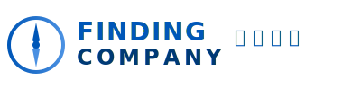
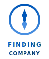

# Finding Company 视觉识别系统 (VI)

**版本**: 1.0
**更新日期**: 2026-04-11
**适用对象**: 户外运动的智能化AI硬件公司
**语言**: 中英双语

---

## 📦 项目结构

```
finding-company-vi/
├── README.md                          # 项目说明（本文件）
├── VI-GUIDELINES.md                  # VI完整规范文档
├── logo/
│   ├── finding-logo-primary.svg      # 主Logo（横版）
│   └── finding-logo-icon.svg         # 图标版（竖版）
├── templates/
│   ├── ppt-template.html             # PPT模板（10页示例）
│   ├── word-template.html            # Word文档模板
│   ├── meeting-minutes-template.html # 会议纪要模板
│   └── weekly-report-template.html   # 周报模板
├── assets/
│   ├── color-palette.html            # 品牌色卡（在线查看）
│   ├── FONTS.md                      # 字体规范文档
│   └── [字体文件]                    # 需自行下载补充
└── [预览文件]                        # 可在此放置导出效果
```

---

## 🎨 品牌核心

### Logo 设计理念

- **图形元素**: 指南针圆点，象征"Finding"的探索精神
- **配色**: Finding Blue (#0057B8) 到 Sky Light (#4A90E2) 渐变
- **中英双语**: FINDING COMPANY + 斐丁科技
- **风格**: 简约、科技、现代

### 色彩系统

| 名称 | HEX | 使用场景 |
|------|-----|----------|
| Finding Blue `#0057B8` | Logo、主标题、按钮 |
| Deep Ocean `#003A75` | 导航、强调、页脚 |
| Sky Light `#4A90E2` | 高光、次要元素 |
| Cloud White `#FFFFFF` | 背景 |
| Midnight `#1A1A1A` | 正文、图表 |

---

## 🛠️ 快速开始

### 1. 下载字体

参照 `assets/FONTS.md` 下载并安装以下字体：

- **Inter** (英文字体) - Google Fonts免费
- **JetBrains Mono** (代码字体) - 免费
- **思源黑体** (中文字体) - Adobe开源，免费商用

### 2. 导出模板

**PPT模板**:
1. 用Chrome/Edge打开 `templates/ppt-template.html`
2. 按 `F12` 进入开发者工具
3. 按 `Ctrl+P` (Windows) 或 `Cmd+P` (Mac)
4. 选择"打印" → "另存为PDF"（或直接使用PowerPoint导入HTML）
5. 页面设置：页面大小 1920×1080px (16:9)，边距 0

**Word模板/纪要/周报**:
1. 用浏览器打开对应的HTML文件
2. 打印为PDF（页面大小 A4 210×297mm）
3. 或使用Word的"打开"功能直接导入HTML

### 3. 使用Logo

```html
<!-- 主Logo -->


<!-- 图标版（小尺寸） -->

```

**SVG优势**: 可无损缩放，文件小，支持CSS修改颜色（如 `fill="#003A75"`）

---

## 📄 模板说明

### PPT模板 (ppt-template.html)

**页面数量**: 10页示例（可复制扩展）
- 封面页
- 目录
- 市场机遇
- 产品方向
- 技术路径
- 商业模式
- 竞争格局
- 执行计划
- 风险与应对
- 感谢页

**样式特点**:
- 16:9比例，1920×1080px
- 页眉页脚自动设置
- 数据卡片、图表占位符
- 双语标题示例

### Word模板 (word-template.html)

**适用场景**:
- 项目提案
- 商业计划书
- 产品说明书
- 技术文档

**特性**:
- A4页面，标准边距
- 多级标题样式
- 表格样式统一
- 引用块高亮
- 首行缩进（中文规范）

### 会议纪要 (meeting-minutes-template.html)

**信息结构**:
- 会议基本信息（时间、地点、主题）
- 参会人员（可区分线上线下）
- 会议议程（时间轴）
- 讨论内容（分议题+决策高亮）
- 行动项表格（负责人+截止+状态）
- 下次会议安排
- 附件列表

**特色功能**:
- 状态标签（待开始/进行中/已完成）
- 决策卡片突出显示
- 行动项表格，支持状态筛选
- 自动填充日期

### 周报 (weekly-report-template.html)

**核心模块**:
1. **KPI指标卡** - 完成率、任务数、延期、饱和度
2. **本周完成** - 任务列表（完成/进行中/延期）
3. **下周计划** - 预期产出明确
4. **数据指标** - 图表占位符
5. **风险与问题** - 三级风险展示
6. **需要支持** - 资源申请清单
7. **签名区** - 撰写/审核/抄送

**设计亮点**:
- 现代卡片式布局
- 颜色编码的任务优先级
- 风险等级可视化（高/中/低）
- 自动计算周数

---

## ⚠️ 使用规范

### 禁用操作

- ✗ 禁止修改Logo形状、比例
- ✗ 禁止更改品牌色（除黑白反色）
- ✗ 禁止使用非指定字体（紧急情况除外需申请）
- ✗ 禁止在Logo周围添加阴影/描边/滤镜

### 最小尺寸

- Logo图形直径 ≥ 8mm (印刷) / 24px (屏幕)
- 正文字号 ≥ 10pt (可读性保障)
- PPT标题 ≥ 28pt (投影清晰）

### 背景使用

- **白色背景**: 使用标准 Finding Blue Logo
- **深色背景**: 使用白色反色Logo（可通过CSS `filter: invert(1)` 实现）
- **图片背景**: 确保对比度足够，必要时添加遮罩

---

## 🔄 版本更新记录

| 版本 | 日期 | 更新内容 |
|------|------|----------|
| 1.0  | 2026-04-11 | 初始版本，包含Logo、PPT、Word、纪要、周报模板 |

---

## 📞 联系方式

如有VI使用问题，请联系：
- Design Team: design@findingtech.com
- 规范更新申请: ceo@findingtech.com

---

**Finding Company · 斐丁科技**
户外运动的智能化 AI 硬件
www.findingtech.com
